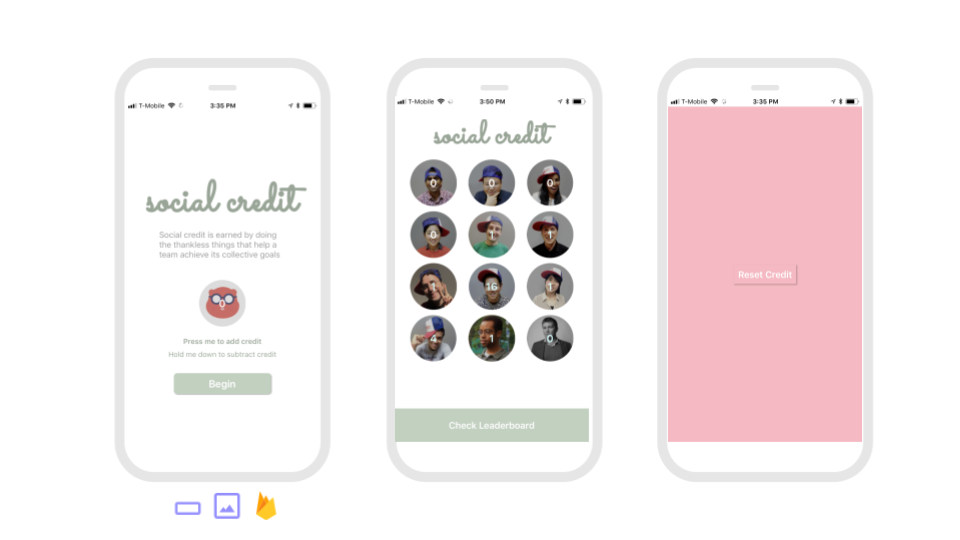
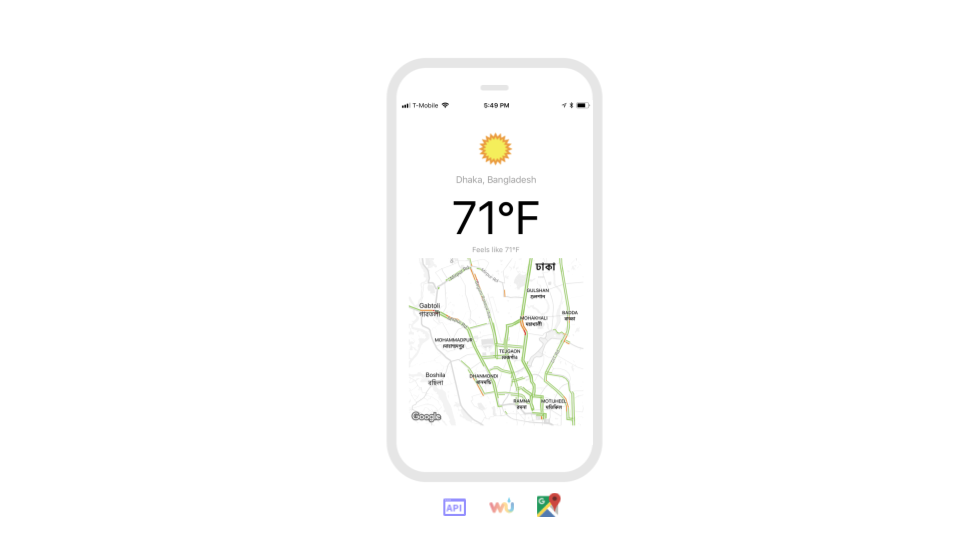
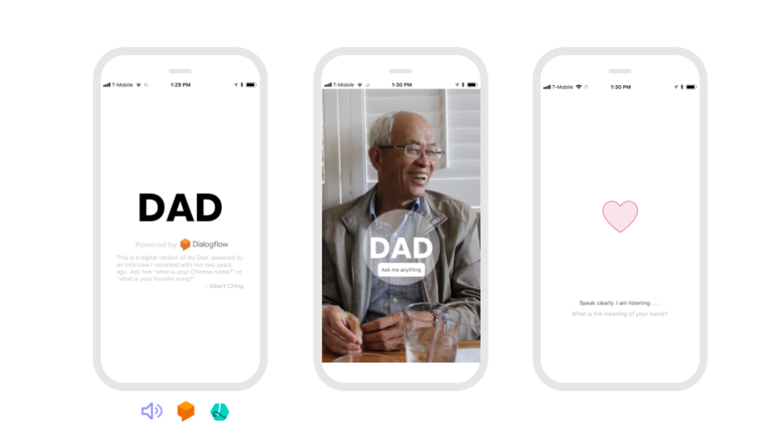
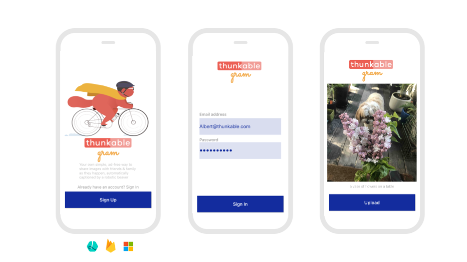

# Sample Apps

##  

Thunkable is building the world's largest gallery of open sourced apps to help inspire you and save you time.

Below are a few of our favorites with more to come. Feel free to remix!

## Beginner

### New Market Goods

New Market Goods is a simple website app with a branding screen and a social media bar that opens a deep link to a user's installed apps that works across platforms. We recommend [URL genius](https://app.urlgeni.us/#/) to find deep links for commonly used apps. No set-up is required.

#### [Click to remix](https://goo.gl/Df56zz)

### Feelings

Feelings is a swipe-able audio book powered by a Tab Navigator and a Text to Speech component. No set-up is required.

#### [Click to remix](https://goo.gl/xs2ZYn)

### Aloha

Aloha is a simple anonymous chat app powered by a Firebase Realtime Database. No set-up is required.

#### [Click to remix](https://goo.gl/a4zj7h)

## **Medium**

### **こんにちは \(Kon'nichiwa / Hello in Japanese\)**

こんにちは is an app designed for travel in any country. It uses the newly upgraded [Speech Recognizer](../2-create/components/artificial-intelligence/speech-recognizer.md) combined with the [Translator](../2-create/components/artificial-intelligence/translator.md) component powered by Yandex to translate any spoke phrase into one of 87 supported languages. 

[**Click to remix**](https://goo.gl/v3qXBn)

### Personal News

Personal News is an easy to edit newsfeed of your favorite websites, powered by a simple Airtable [spreadsheet](../2-create/components/data-storage/spreadsheet.md) with Articles and Descriptions that you can modify at any time. This app can be remixed in a number of ways from displaying help content for your products in a more optimized way to sharing your favorite products from your e-commerce business. This app features a Stack Navigator and a Share component as well!

#### [Click to remix](https://goo.gl/215j2a)

### Social Credit

Social Credit is a team counting app for thankless tasks. The app shares data for the team in a private Firebase realtime database account so Thunkers looking to create one for their team will need to [set one up](https://docs.thunkable.com/x/components/data-storage/realtime-db.html#set-up). The app also features some basic error handling and a for loop block

#### [Click to remix](https://goo.gl/J9dkd2)

### Weather

Weather is an app that pulls the latest temperature from the Weather Underground API and as a bonus the latest traffic from the Google Maps component; Thunkers will need to create a free account to create their own Weather Underground API key

#### [Click to remix](https://goo.gl/aAH6eM)

### Translator

Translator is an app that translates English text into the 20 most popular languages in the world; features advanced use of ListView and persistent data with Local Storage. No set-up is required although Thunkers can use their own Yandex API key if desired

#### [Click to remix](https://goo.gl/vYQNt2)

### Dad

Dad is a digital version of Albert's dad, based on a recorded interview and powered by Dialogflow's Assistant service. Thunkers must create their own Dialogflow account to customize their digital version.

#### [Click to remix](https://goo.gl/mf5vUk)

## Advanced

### Reservation

Reservation is a demonstration of how to accept credit card payments through your app. Thunkers must create their own Stripe account \(please [follow the documentation](https://docs.thunkable.com/ios/components/monetisation/payments.html) carefully on set-up\). The app also uploads user data to a [spreadsheet](https://docs.thunkable.com/ios/components/data-storage/spreadsheets.html) for proper tracking of user transactions.

#### [**Click to remix**](https://goo.gl/XY9cTx)

### Gram

Gram is who photo sharing should be -- ad-free, auto-captioning and secure. Thunkers must create their own Firebase account and add their own API keys and database url in their account settings

#### [Click to remix](https://goo.gl/itPXez)

