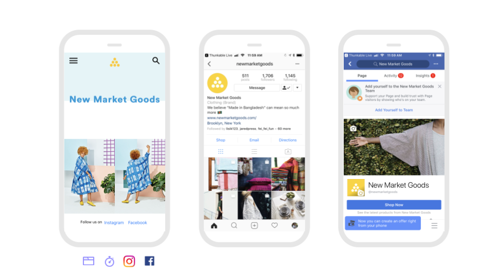
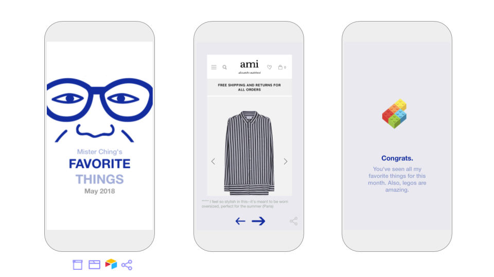
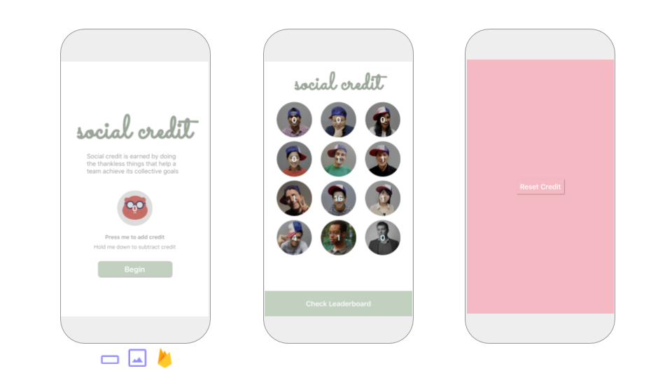
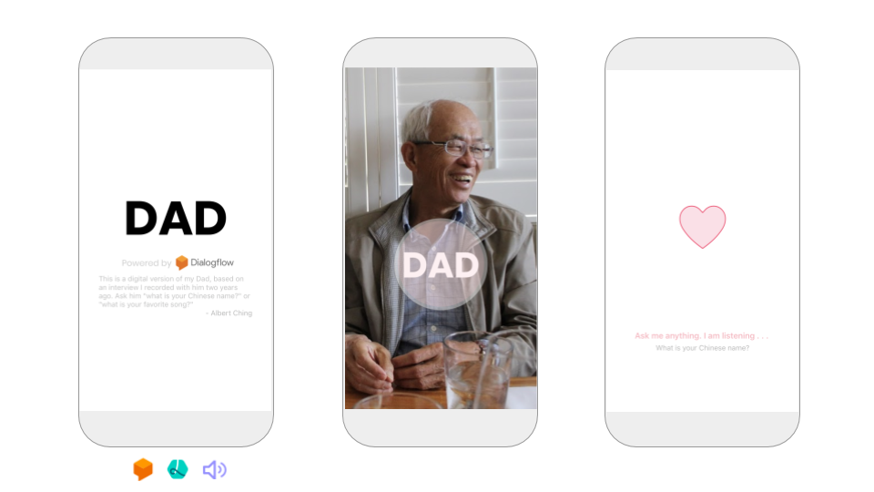
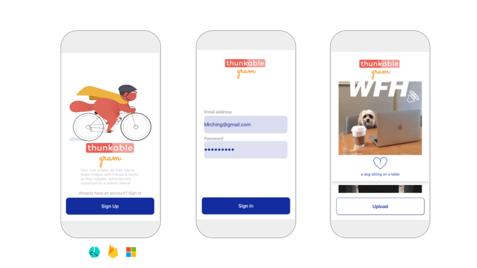

# Sample Apps

##  

Thunkable is building the world's largest gallery of open sourced apps to help inspire you and save you time.

Below are a few of our favorites with more to come. Feel free to remix!

## Beginner

### New Market Goods

New Market Goods is a simple website app with a branding screen and a social media bar that opens a deep link to a user's installed apps that works across platforms. We recommend [URL genius](https://app.urlgeni.us/#/) to find deep links for commonly used apps. No set-up is required.

#### [Click to remix](https://goo.gl/Df56zz)

### Feelings

Feelings is a swipe-able audio book powered by a Tab Navigator and a Text to Speech component. No set-up is required.

#### [Click to remix](https://goo.gl/xs2ZYn)

## **Medium**

### Aloha

Aloha is a private anonymous chat app with a short chat history powered by a [Firebase Realtime Database](../2-create/components/data-storage/realtime-db.md). To [keep your data as private as possible](../2-create/app-data-privacy.md#create-your-own-private-repository-of-cloud-data), we recommend creating your own Firebase account and add your own API keys.

#### [Click to remix](https://goo.gl/jPNbTN)

### **こんにちは \(Kon'nichiwa\)**

こんにちは is an app designed for travel in any country. It uses the newly upgraded [Speech Recognizer](../2-create/components/artificial-intelligence/speech-recognizer.md) combined with the [Translator](../2-create/components/artificial-intelligence/translator.md) component powered by Yandex to translate any spoke phrase into one of 87 supported languages. The app also features persistent data using [Local Storage](../2-create/components/data-storage/local-storage.md), importing a list of data from [Spreadsheet](../2-create/components/data-storage/spreadsheet.md), and sharing results with the [Share](../2-create/components/social/share.md) component.

[**Click to remix**](https://goo.gl/DHp6Qv)


This a


### Personal Feed

Personal Feed is an easy to edit feed of your favorite websites, powered by a simple Airtable [spreadsheet](../2-create/components/data-storage/spreadsheet.md) with descriptions that you can modify at any time. This app can be remixed in a number of ways but this example shares popular men's blogger Mister Ching's favorite products for the summer. This app features a Stack Navigator, a Share component, and custom fonts in Labels as well!

#### [Click to remix](https://goo.gl/3Y9WuD)

### Social Credit

Social Credit is a team counting app for thankless tasks. The app shares data for the team in a private Firebase realtime database account so Thunkers looking to create one for their team will need to [set one up](https://docs.thunkable.com/x/components/data-storage/realtime-db.html#set-up). The app also features some basic error handling and a for loop block

#### [Click to remix](https://goo.gl/2vCtAh)

### Weather

Weather is an app that pulls the latest temperature from the Weather Underground API and as a bonus the latest traffic from the Google Maps component; Thunkers will need to create a free account to create their own Weather Underground API key

#### [Click to remix](https://goo.gl/aAH6eM)

### Translator

Translator is an app that translates English text into the 20 most popular languages in the world; features advanced use of ListView and persistent data with Local Storage. No set-up is required although Thunkers can use their own Yandex API key if desired

#### [Click to remix](https://goo.gl/vYQNt2)

### Dad

Dad is a digital version of Albert's dad, based on a recorded interview and powered by Dialogflow's [Assistant](../2-create/components/artificial-intelligence/assistant.md) service. Thunkers must create their own Dialogflow account to customize their digital version. You can read more of the story of this app on [our blog](https://blog.thunkable.com/meet-my-dad-in-an-app-8a93ded720e0).

#### [Click to remix](https://goo.gl/P94huP)

## Advanced

### Ride

Ride is a simple uber-like app designed for a single rider and driver that demonstrates some of the more complex possibilities of using the Google Maps APIs with the [Web API](../2-create/components/data-storage/web-api.md) component including the geocoding, distance matrix and routing APIs.  Developers will have to first create and use their own Google Maps API key and [Realtime DB](../2-create/components/data-storage/realtime-db.md) with Firebase. This is the first sample app that uses the cool renaming component feature that was just implemented.


This sample app currently crashes on Android but we are hoping to add a bug-free version soon


[**Click to remix**](https://goo.gl/hzH5Hz)

### Reservation

Reservation is a demonstration of how to accept credit card payments through your app. Thunkers must create their own Stripe account \(please [follow the documentation](https://docs.thunkable.com/ios/components/monetisation/payments.html) carefully on set-up\). The app also uploads user data to a [spreadsheet](https://docs.thunkable.com/ios/components/data-storage/spreadsheets.html) for proper tracking of user transactions.

#### [**Click to remix**](https://goo.gl/XY9cTx)

### Gram

Gram is what photo sharing should be -- ad-free, auto-captioning and secure. This app features the Sign In component with Realtime DB both powered by Firebase, Image Recognizer by Microsoft and a way to "heart" photos. Thunkers must create their own Firebase account and add their own API keys and database url in their account settings.

#### [Click to remix](https://goo.gl/gT6qEm)

