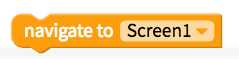
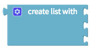
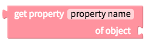

# ⎍ Blocks

Every component has its own set of blocks. The categories below represented blocks that are preloaded in every app project

| **Logic** | **Control** | **Math** |
| :--- | :--- | :--- |
|  |  |  |
| **Text** | **Lists** | **Colour** |
|  |  |  |
| **Objects** | **Variables** | **Functions** |
|  |  |  |

