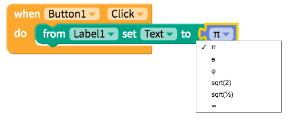
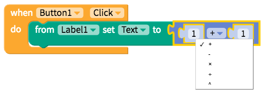
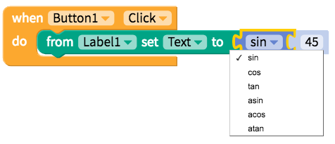
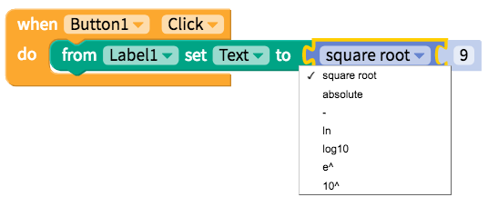
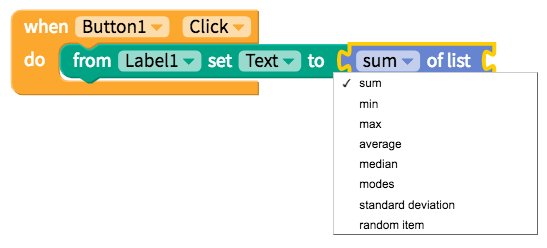
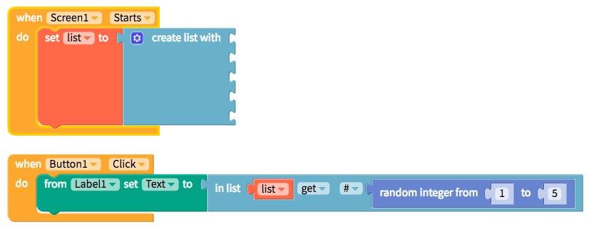

# Math

* [Numeric value](math.md#numeric-value)
* [Perform calculations](math.md#perform-calculations)
* [Introduce randomness](math.md#introduce-randomness)
* [Other](math.md#other)

## Numeric value

You can also round up or down a decimal figure into an integer using the block below

There is also a block for irrational numbers like `π`

|  |
| :--- | :--- |

## Perform calculations

Perhaps the most often used calculation in an app is `addition` but this block also supports `subtraction`, `multiplication`, `division` and `exponential` figures

|  |
| :--- | :--- |

There are also a few more advanced calculation blocks that may be helpful including `trigonometric`

|  |
| :--- | :--- |

`logarithmic`

|  |
| :--- | :--- |

and `remainder`

There's also this useful calculation block for lists

|  |
| :--- | :--- |

## Introduce randomness

For games and other apps, it may be important to introduce randomness into your app

One way to select randomly from a list is depicted below

## Other

There are a couple of blocks that don't seem to fit into the previous categories that may be helpful for your app

