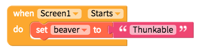

# Variables

* [Create variable](variables.md#create-variable)
* [Set variable](variables.md#set-variable)
* [Change variable](variables.md#change-variable)

## Create variable

To create a variable for your app, you simply have to click on the block below and give it a name

## Set variable

Most often you will set a variable in your app when the Screen starts

## Change variable

The reason to have variables in your app is if you will be changing its value as your app proceeds. If you're variable is a number, there is a block that will increase it by a value every time it is used

