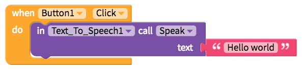

# Text to Speech

* [Select spoken language](text-to-speech.md#select-spoken-language)
* [Speak](text-to-speech.md#speak)

## Select spoken language

To set up the Text to Speech component, simply select the spoken language that will correspond with the text provided. There are currently over 85 languages you can choose from

| Property | Description |
| :--- | :--- |
| Language | The name of the language to speak aloud; currently available in over 85 languages |

## Speak

The blocks below speak aloud the text`Hello world`

| Event | Description |
| :--- | :--- |
| Speak \(`text`\) | Speaks a given `text` |
| Stop | Stops speaking a given text |

