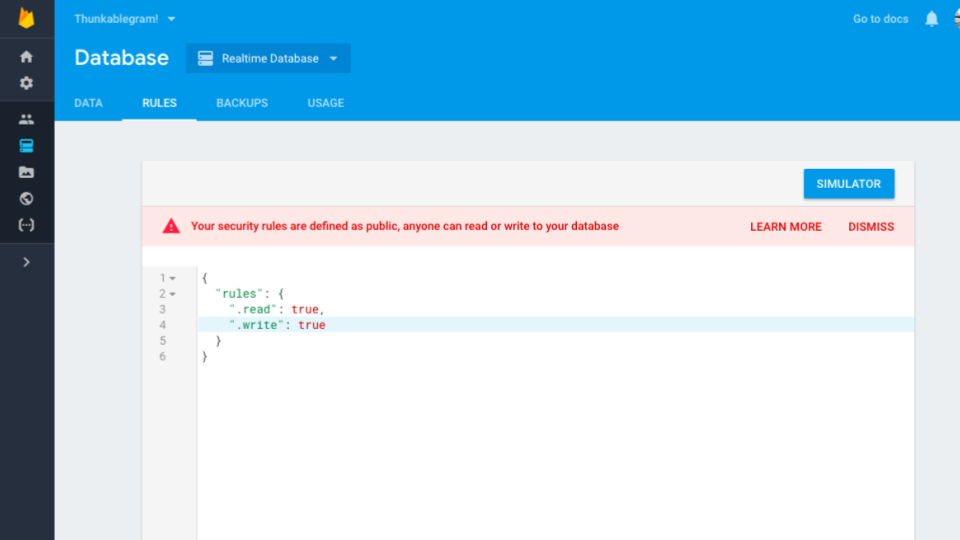
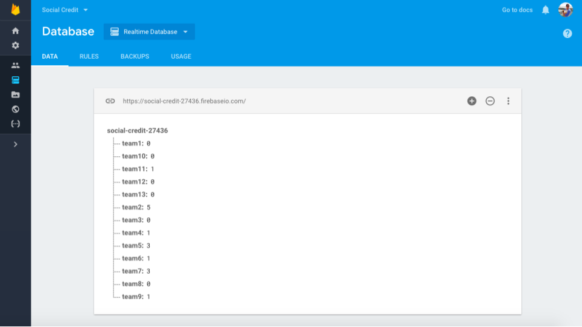
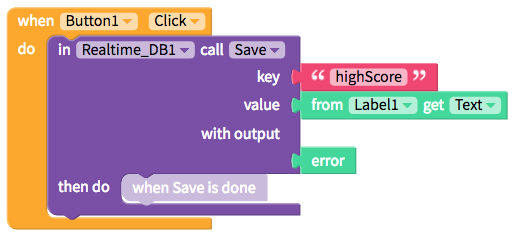
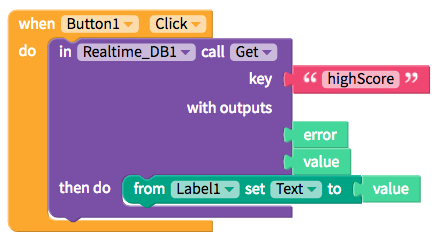
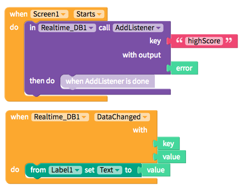

# Realtime DB

This storage option is useful for anything from saving game high scores to tracking social credit.


We highly recommend you use your own Firebase account with your app


With the increased focus on user privacy, we strongly advise that you use own Firebase account both to ensure the privacy of your user data and to give you visibility into the database itself. We provide our database for your convenience but we may also clean out our shared account periodically

* [Set up](realtime-db.md#set-up)
* [Save data](realtime-db.md#save-data)
* [Get data](realtime-db.md#get-data)
* [Update data in real-time](realtime-db.md#update-data-in-real-time)

## Set up your own Firebase account

Thunkable provides a default Firebase account for testing purposes. When your app is ready to be distributed, we strongly advise connecting your app to your personal Firebase instance.

Firebase Realtime Database also pairs well with [Sign in](https://github.com/thunkable/thunkable-docs/tree/4a752596e288fca776105e94dc5e863bb9a3e25a/ios/components/screen-layout/authentication/sign-in.md) and you can use a single Firebase project for both services.

### Create your free [Firebase](https://firebase.google.com/) project and account

### Edit database rules

If you are using [Sign In](../security/sign-in.md) powered by Firebase in your app, you do not need to edit the default database rules which permit reading and writing to the database for authorized users.

Otherwise, you will need to set your Read and Write rules to `true`

### Connect your Firebase project with Thunkable

To connect your Firebase project with Thunkable, you'll have to add an `API key` and `Database URL` to the Firebase Settings in the App Settings, which you can find by clicking on your app icon

One way to retrieve the `API key` and `Database URL` from Firebase is to click on the `Add Firebase to your web app option`

### Test save to your database

Once your project is connected to your Thunkable app, we recommend that you do a simple test and save a value into your database. It should appear in your data tab in your Firebase console.

## Save data

| Event | Description |
| :--- | :--- |
| Save \(`key`, `value`\) | Asks Firebase to save a given `value` under the given `key` |

## Get data

| Event | Description |
| :--- | :--- |
| Get \(`key`,`value`\) | Asks Firebase to get the`value`stored under the given`key` |

## Update data in real-time

| Event | Description |
| :--- | :--- |
| Add Listener \(`key`\) | Asks Firebase to listen to a specific`key`for changes in the database. Required for Data Changed block. |
| Data Changed \(`key`,`value`\) | Asks Firebase for updates to`value`for specified`key`. Requires an Add Listener block. |
| Remove Listener \(`key`\) | Ask Firebase to stop listening to a specific`key`for changes in the database |

