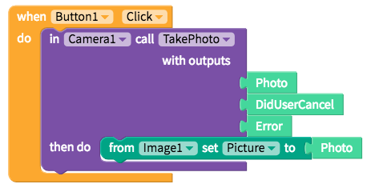

# Image

The Image components lets you reference pictures added to your app or on the web and pairs nicely with image based components like the [Camera](camera.md), [Photo Library](photo-library.md), [Image Recognizer](image-recognizer-1.md) and [Media DB](../data-storage/media-db.md)

* [Set Image](image.md#set-image)
* [Edit Image size](image.md#edit-image-size)
* [Style the Image](image.md#style-the-image)
* [Add spacing](image.md#add-spacing)

## Set Image

#### Take picture with Camera and set Image

| Property | Description |
| :--- | :--- |
| Picture | You can upload an image to your app, reference an image url e.g. `beaver-yellow.png`, or set your picture with another component like the Camera |

## Edit Image size

Sizing your Image requires setting the area of your app you want the Image to cover and resizing the Image to fit into that area

For more information on sizing in your app, please see our [introduction here​](https://docs.thunkable.com/~/edit/primary/thunkable-cross-platform/2-create/intro-to-sizing)

#### Setting the area of your app the Image covers


There is currently a bug that does not show your Image when the height or width is set to `Fit contents` We will fix it soon!


| Property | Description |
| :--- | :--- |
| Height | Default \(`40%`\); Four options: 1\) `Fit contents` which auto-sizes to the content size or 2\) `Fill container` which auto-sizes to the container 3\) `Relative size` in percent of Screen, 4\) `Absolute size` in pixels |
| Width | Default \(`85%`\); Four options: 1\) `Fit contents` which auto-sizes to the content size or 2\) `Fill container` which auto-sizes to the container 3\) `Relative size` in percent of Screen, 4\) `Absolute size` in pixels |

#### Resizing the Image

Due to different screen sizes and pixel densities, it is nearly impossible for you to size your image to exactly fit the area both in terms of dimensions and pixel density. This is where the resize property comes into play

| Property | Description |
| :--- | :--- |
| Resize mode | Default \(`contain`\); Five options: 1\) `Contain` resizes to fit the area regardless of image quality or 2\) `Center` centers the image and sizes it to its image quality  3\) `Cover` resizes image to its max height or width regardless of image quality and crops the other dimension, 4\) `Repeat` repeats the image at its original image quality as many times as possible within the image area, 5\) `Stretch` stretches the image to the image area |

## Style the Image

| Property | Description |
| :--- | :--- |
| Border | Default \(`none`\); You can set the `width`, `color` and `style` of the button border |
| Background Color  `Advanced` | Default \(`none`\); Sets the background color of the Image \(if there is space not covered by the image\) |

## Add spacing

For more information on adding spacing in your app, please see our [introduction here](../../intro-to-spacing.md)

To find the spacing properties, you'll have to select the `Advanced` tab

| Property | Description |
| :--- | :--- |
| Margin `Advanced` | Default \(`none`\); Margin is the space outside of the border of a component; You can set space on the `top`, `bottom`, `right` or `left` of the component in both pixels or percent of Screen |
| Padding `Advanced` | Default \(`none`\); Padding is the space between the contents and the border of a component; You can set space on the `top`, `bottom`, `right` or `left` of the component in both pixels or percent of Screen |

