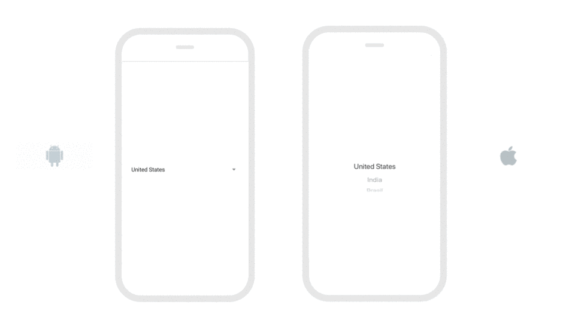
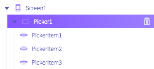
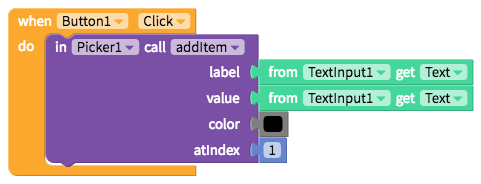
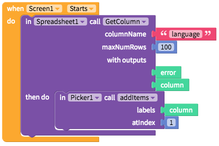

# Picker + Picker Item

## Add Picker Items to a Picker

Unlike in a List Viewer where you connect a List of Items, to add items to a Picker, you can simply drag an drop Picker Items into a Picker

Each Picker Item has a `label`, which is what shows up in the picker, and a `value` that is hidden but associated with each label.

| Property | Description |
| --- | --- | --- |
| Label | Default \(none\); The label of the Picker Item |
| Value | Default \(none\); The value of the Picker Item; can be specified as a number or a string |

## Add and Remove Picker Items

The Picker also allows a developer to add and remove items in a list using blocks like the one below:

| Property | Description |
| --- | --- | --- |
| Add Item \(`label`, `value`, `color`, `atIndex`\) | Add a single item to the Picker list where `label` is the label of the Picker item, `value` is the value of the Picker item, `color` is the text color of the item and `atIndex` is the position on the list of where to add items, where 1 = first item |
| Remove Item \(`atIndex`\) | Removes a single item in the Picker list where `atIndex` is the position on the list where to remove the item and 1 = first item |

## Import list of items to a Picker

It is also possible to set items in a Picker to a list that you define when the Screen opens or import from a Spreadsheet like the example below:

| Property | Description |
| --- | --- |
| Add Items \(`labels`, `atIndex`\) | Add a list of items to the Picker list where `labels` is the list of labels and `atIndex` is the position on the list of where to add items, where 1 = first item |

