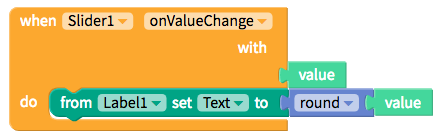

# Slider

* [Set up](slider.md#set-up)
* [Style the Slider](slider.md#style-the-slider)
* [Edit the Slider size](slider.md#edit-the-slider-size)
* [Add spacing](slider.md#add-spacing)

## Set up

To set up a slider, you'll have to first define the `minimum` and `maximum` values, the initial `value` and the incremental `steps` of the slider

We recommend using a Label with the Slider so that users can get immediate feedback on the value she or he is setting

| Property | Description |
| :--- | :--- |
| Minimum Value | Default \(`0`\); Minimum and leftmost value of the Slider |
| Maximum Value | Default \(`100`\); Maximum and rightmost value of the Slide |
| Value | Default \(`0`\); Initial value of the Slider |
| Step | Default \(`0`\); Increments of the Slider |

## Style the Slider

| Property | Description |
| :--- | :--- |
| Minimum Track Tint Color | Default \(`none`\); Color of the slider track to the left of the thumb |
| Minimum Track Tint Color | Default \(`none`\); Color of the slider track to the right of the thumb |
| Thumb Tint Color \(Android only\) | Default \(`none`\); Color of the thumb |
| Border | Default \(`none`\); You can add a border with customized `width`, `color`, `style (solid, dotted, dashed)`and `borderRadius` |

### Edit the Slider size

For more information on sizing in your app, please see our [introduction here​](https://docs.thunkable.com/~/edit/primary/thunkable-cross-platform/2-create/intro-to-sizing)

| Property | Description |
| :--- | :--- |
| Height | Default \(`Fit contents`\); Four options: 1\)`Fit contents`which auto-sizes to the content size or 2\)`Fill container`which auto-sizes to the container 3\)`Relative size`in percent of Screen, 4\)`Absolute size`in pixels |
| Width | Default \(`Fit contents`\); Four options: 1\)`Fit contents`which auto-sizes to the content size or 2\)`Fill container`which auto-sizes to the container 3\)`Relative size`in percent of Screen, 4\)`Abso` |

## Add spacing

For more information on adding spacing in your app, please see our [introduction here](../../intro-to-spacing.md)

To find the spacing properties, you'll have to select the `Advanced` tab

| Property | Description |
| :--- | :--- |
| Margin `Advanced` | Default \(`none`\); Margin is the space outside of the border of a component; You can set space on the `top`, `bottom`, `right` or `left` of the component in both pixels or percent of Screen |
| Padding `Advanced` | Default \(`none`\); Padding is the space between the contents and the border of a component; You can set space on the `top`, `bottom`, `right` or `left` of the component in both pixels or percent of Screen |

