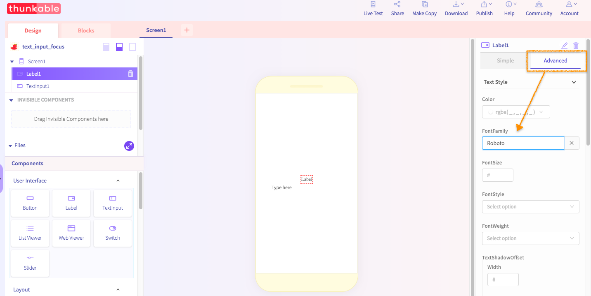

# Design Tips

## Fonts

You can currently change the font on the [**Label**](components/user-interface/label.md) and [**TextInput**](components/user-interface/text-input.md) components by setting their **FontFamily** property in the Advanced tab. 

The available font choices differ depending on whether you are developing for [Android](design-tips.md#android-fonts) or [iOS](design-tips.md#ios-fonts) and are listed below. 

### Android Fonts

normal

notoserif

sans-serif

sans-serif-light

sans-serif-thin

sans-serif-condensed

sans-serif-medium

serif

Roboto

monospace

### iOS Fonts

Academy Engraved LET

AcademyEngravedLetPlain

Al Nile

AlNile-Bold

American Typewriter

AmericanTypewriter-Bold

AmericanTypewriter-Condensed

AmericanTypewriter-CondensedBold

AmericanTypewriter-CondensedLight

AmericanTypewriter-Light

Apple Color Emoji

Apple SD Gothic Neo

AppleColorEmoji

AppleSDGothicNeo-Bold

AppleSDGothicNeo-Light

AppleSDGothicNeo-Medium

AppleSDGothicNeo-Regular

AppleSDGothicNeo-SemiBold

AppleSDGothicNeo-Thin

AppleSDGothicNeo-UltraLight

Arial

Arial Hebrew

Arial Rounded MT Bold

Arial-BoldItalicMT

Arial-BoldMT

Arial-ItalicMT

ArialHebrew

ArialHebrew-Bold

ArialHebrew-Light

ArialMT

ArialRoundedMTBold

Avenir

Avenir Next

Avenir Next Condensed

Avenir-Black

Avenir-BlackOblique

Avenir-Book

Avenir-BookOblique

Avenir-Heavy

Avenir-HeavyOblique

Avenir-Light

Avenir-LightOblique

## Colors

### RGBa

### Hexadecimal

