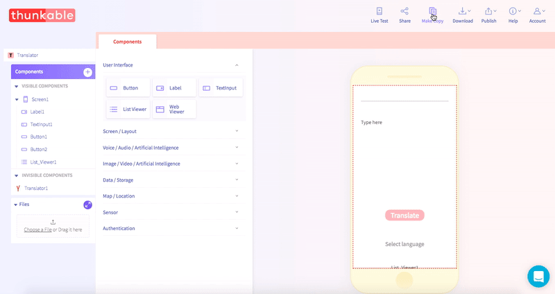

# Make Copy

## 

When you have invested time building your app, you may want to make a copy of your app project. To do so, just select 'Make Copy.' A copy will automatically be generated and appear in your project page.

