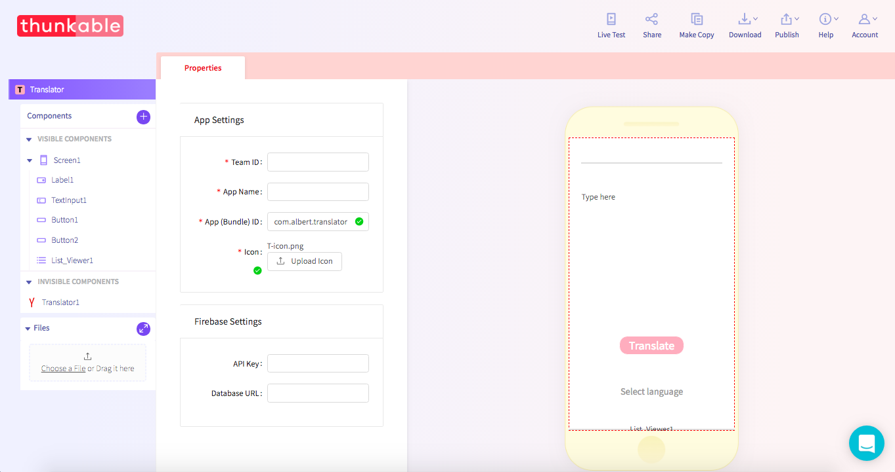

# Package Name + Bundle ID

Thunkable supports custom package names as they are known in Android or app bundle IDs as they are known in iOS. Users will never normally see these names but Android and iOS requires your user package names / app bundle IDs to be unique for listing on their separate stores.

### Default Package Name / App Bundle ID

`com.emailprovider.username.projectname`

### Customizing Your App \(Bundle\) ID / Package Name

Navigate to App Settings by clicking on the app icon in the top left

Then change your Package name/App ID.

