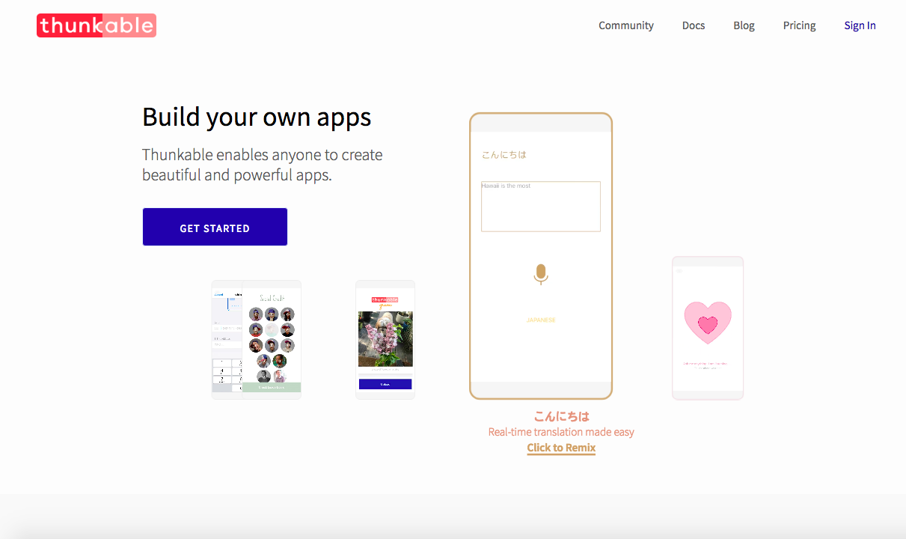

# Public vs Private Projects

One of the first decisions you have to make is whether or not your new project will be public.  Don't worry, you can always change it later here in the App Settings.

## Public projects

### Public projects are eligible to be featured in the Thunkable Gallery on our homepage. Featured projects so far have received a lot of love \(and by love, we mean, remixes\).

### 

### **Public projects can also be shared both in** [**fully-editable**](../5-share.md#share-a-fully-editable-copy-of-your-app-project) **and** [**read-only**](../5-share.md#share-a-read-only-version-of-your-app-project) **mode.**

## Private projects

