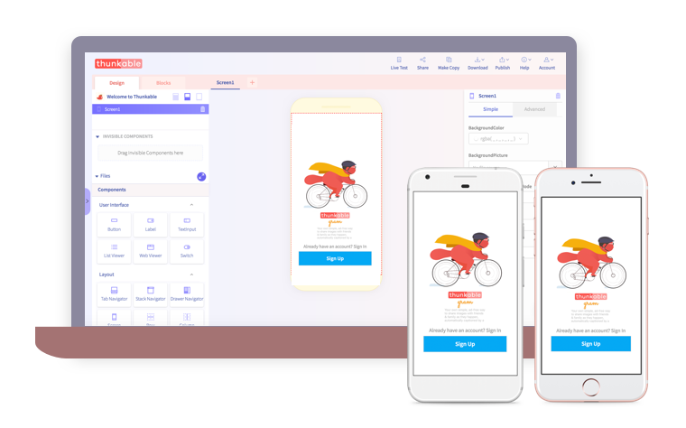

# Thunkable Cross Platform ✕

## Introducing Thunkable Cross-Platform ✕


Thunkable for iOS has become Thunkable Cross-Platform ✕. Your projects have been automatically upgraded to Thunkable Cross Platform ✕ which works exactly like Thunkable iOS did but with the big added benefit of your projects working on Android devices. No importing is necessary and your Thunkable Live app should world with all your projects.


Thunkable Cross-Platform ✕ is the new platform where anyone can build apps on Android or iOS. Users create a single project that works on both Android and iOS devices. 

Thunkable ✕ features a revamped app that lets you preview all your projects without using your desktop, easy to create links to share your projects, modern design capabilities like Tab and Drawer navigators and integrations with some of the hottest technologies today like Assistant by Dialogflow, Payments by Stripe and Spreadsheet by Airtable.

Thunkable ✕ is powered by React Native, one of the most popular technologies available to app developers today.  

