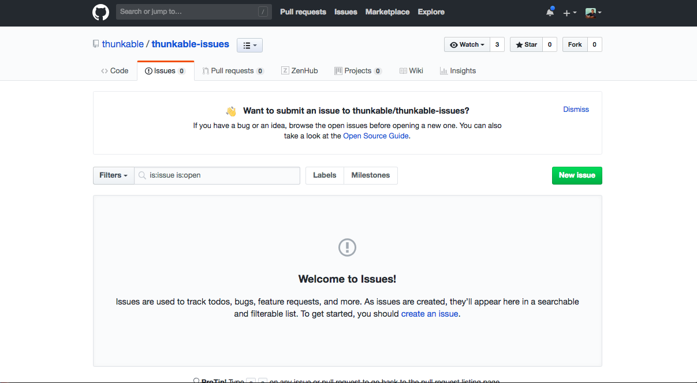
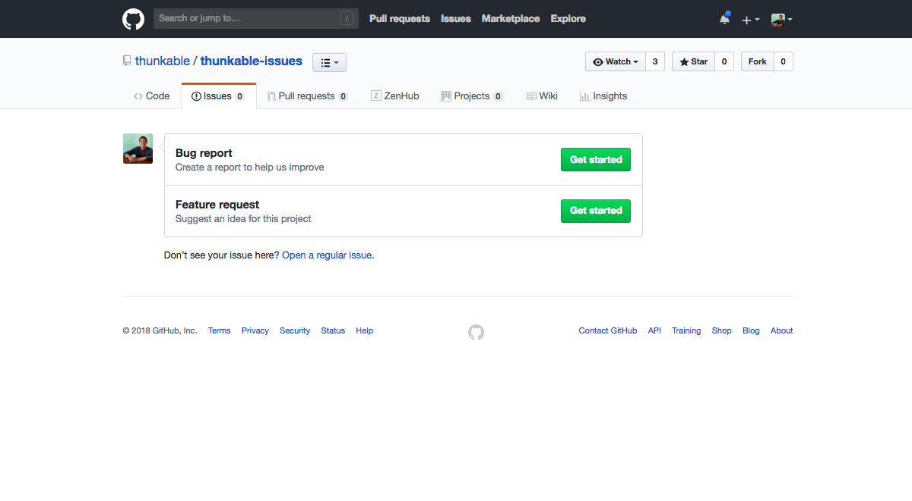
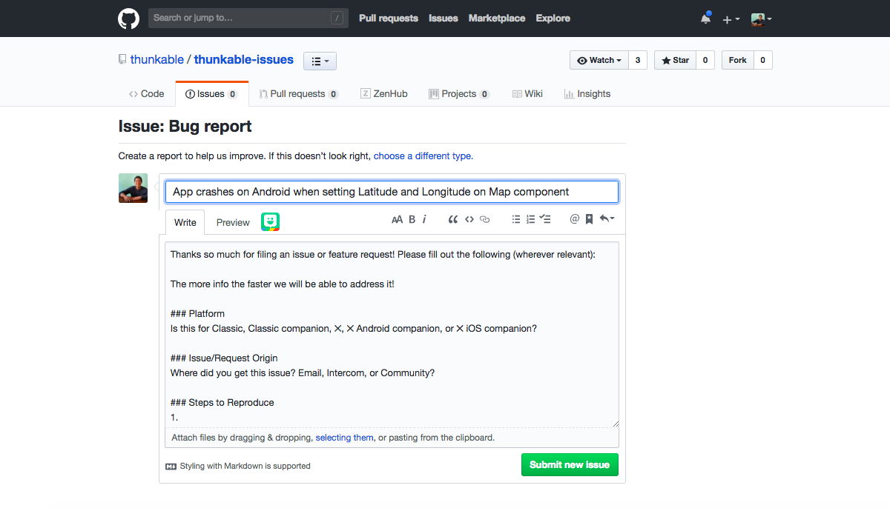
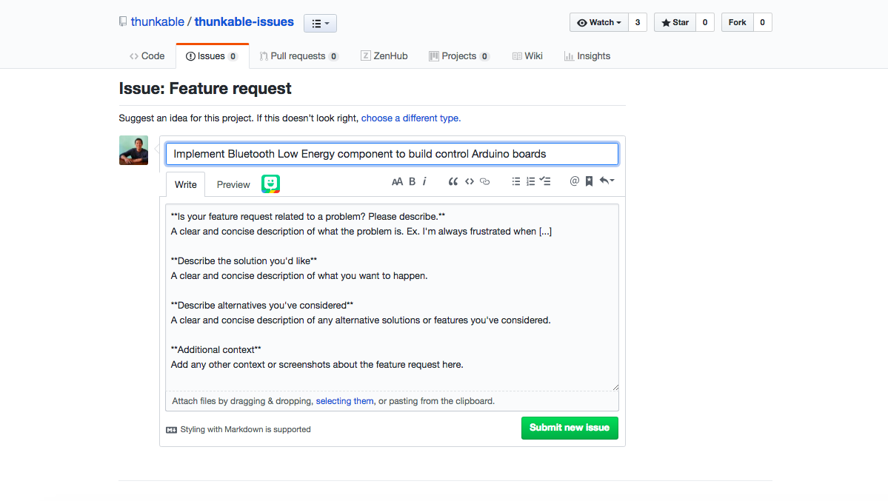

# Bugs and Feature Requests


Bugs are things on our platform that don't work as expected. Feature requests are new functionality that you will like to see added in the near future. 


**One of our chief design principles at Thunkable is that our platform should be community-driven by our amazingly helpful group of very motivated developers**. 

In the past, it's been hard for us to organize and prioritize your requests on the community forum so we are testing out a new way for users to submit us your bugs and feature requests on Github, the same infrastructure our developer team uses to fix the bugs and build the features that will help you build the apps that you want.

To submit a bug or feature request, please follow the steps below.

### Create your free account on [Github](https://github.com/)

### Check to see if your bug or feature request has already been reported in our [Thunkable public repository](https://github.com/thunkable/thunkable-issues/issues)

If your issue has been reported, you can make comments and add additional details to their thread

### If you don't see your bug or feature request, [create a new issue](https://github.com/thunkable/thunkable-issues/issues/new/choose)

First decide if you're issue is a bug report or a feature request


For bug reports, please describe your problem in as much detail as possible \(Cross-Platform X vs Classic, Android vs iOS, what you did\) and if possible, share a copy of your project or the steps to reproduce it \(We can't fix it if we can't reproduce it\)


  


For feature requests, please tell us how you'd like to use the features in as much  detail as possible e.g. what kind of app your are trying to build. This will help us design the feature to match your needs.


