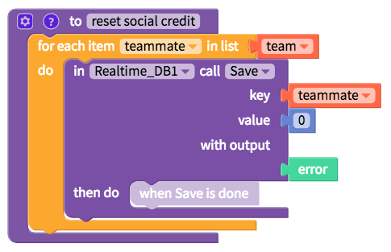
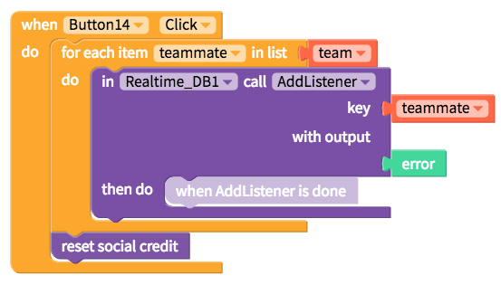

# Functions

* [Create a function](functions.md#create-a-function)
* [Create a function with an output](functions.md#create-a-function-with-an-output)
* [Create a conditional function](functions.md#create-a-conditional-function)

## Create a function

To create a function, you will need to specify if it has any inputs and give it a name

One example of a function is below, featured in our Social Credit sample app

After you have created your function, you can simply use it at any time using the function block you have named

## Create a function with an output

You can also create a function that returns a specific output

## Create a conditional function

You can also create a function that only triggers given a specific condition

## AsynchLoop
