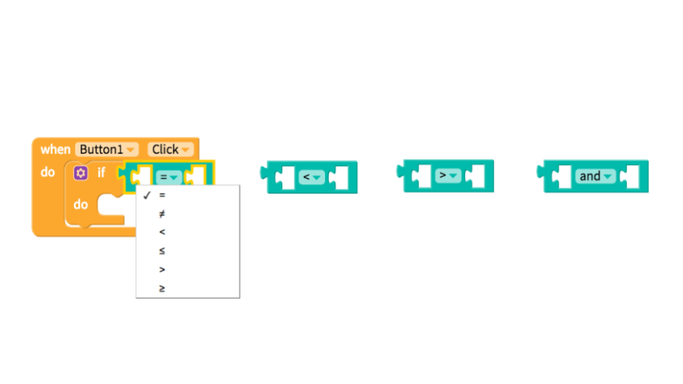
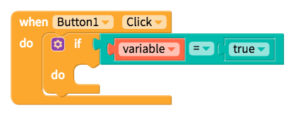

# Logic

## Statement blocks

[If `then`, do `that`](control.md#if-this-do-that) blocks are often paired with statement blocks that test whether a condition is met

## Value blocks

Value blocks can go into the sockets of the statement blocks to define the conditions that are being tested.

The null block is often used when retrieving data from a database or calling a service for the first time

