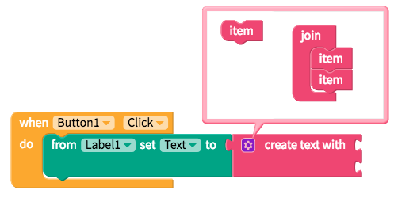
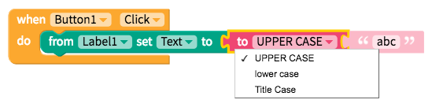
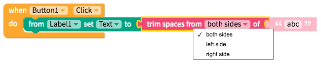

# Text

* [Text value](text.md#text-value)
* [Reformat text](text.md#reformat-text)
* [Analyze text](text.md#analyze-text)

## Text value

The most basic but most often used text block is below

Often, you'll want to join text values together with the block below

|  |
| :--- |

## Reformat text

When you import data from a database or API, you may need to reformat it and the blocks below should help:

|  |
| :--- |

|  |
| :--- |

The block below will help you add additional text to a list of items

## Analyze text

The block below tests whether the text value is empty

while the following blocks search within a text value

This one calculates how many characters are in a given text value

