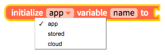
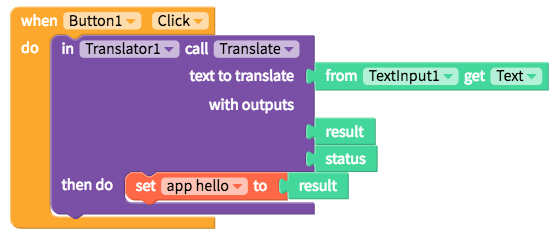
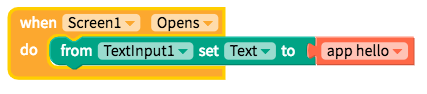
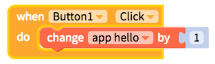

# Variables

## What is a variable?

In app creation, variables work like containers to hold numbers, phrases, the results of a calculation, a database call, or other important values in the app, in the mobile device's local storage or in the cloud.

Instead of repeating these values in multiple places, a variable can be used wherever it is needed in your Blocks code.

## `App`, `stored` and `cloud` variables

When you create a variable, you'll have the choice between an app, stored and cloud variable. All variable types work across screens and the only difference is where they are stored.

An **app** variable works across screens and is stored in the app itself

A **stored** variable also works across screens but is saved to the mobile device itself. This means that a stored variable can be retrieved from a previous session. A stored variable is similar to saving a value to [Local Storage](../components/data/local-storage.md) and is especially useful for retrieving a user's previous setting.

A **cloud** variable also works across screens but is saved to the cloud powered by Firebase. By default, the cloud variable is saved to the Thunkable default Firebase database but you can save them to your own private Firebase database by [following the instructions here](../components/data/realtime-db.md#create-your-free-firebase-project-and-account). Cloud variables can be used similar to saving and retrieving values to a [Realtime DB](../components/data/realtime-db.md) powered by Firebase and can be used in a number of applications that share data across users in the cloud.

## Create and set a variable when the Screen starts

  
To create a variable when the Screen starts, you can grab the block above, select your variable `type` and give the variable a `name` like hello. You'll have to connect a block to it to give it an initial value like blank \(in the picture above\).

## Create and set a variable during an app event

You can also create and set a variable within a Block event like the one above. Simply grab the set variable block and connect it to the value that you want it to be set to.

## Retrieving a variable

Once you have stored a value to your variable, you can retrieve it any time using a block like the one above.

## Changing a variable

  
Variables do not have to be fixed values and there may be times when you want to change your variable automatically like incrementing it by 1 after an event. To do so, grab a block like the one above.

