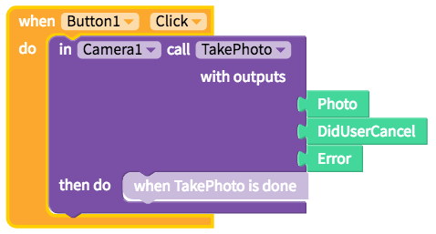

# Camera

* [Take Photo](camera.md#take-photo)

## Take Photo

| Property | Description |
| :--- | :--- |
| Take Photo \(`Photo`, `DidUserCancel`, `Error`\) | Opens the camera and saves the `Photo` after the user takes a picture. `DidUserCancel` is either 'true' or 'false' depending on whether or not the user cancelled taking a photo. `Error` is the error message if there was an error in taking the photo. |

