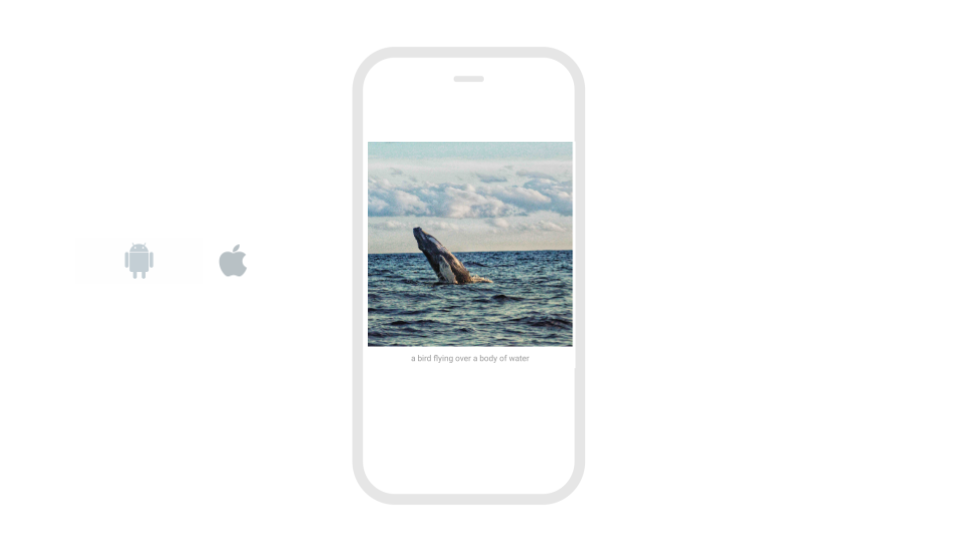
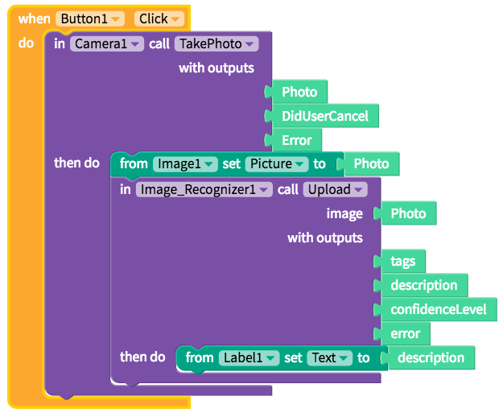

# Image Recognizer

* [Set up](image-recognizer.md#set-up)
* [Auto-caption a picture](image-recognizer.md#auto-caption-a-picture)

## Set up

No set up is required.

Thunkable provides its own API key by default for your convenience. If you expect your users to upload more than 1,000 images per month, please create your own free account with [Microsoft Cognitive Services](https://azure.microsoft.com/en-us/services/cognitive-services/) \(current free limit is 30,000 images per month\)

| Property | Description |
| :--- | :--- |
| Subscription Key | Thunkable provides its own subscription key as `default`. You can add your own if you expect your users to upload more than 1,000 images per month |
| Server Url | Distinct Url required for the Computer Vision API. Do not change the `default` unless you are trying to access this component from China, in which case you need to provide a different server Url |

## Auto-caption a picture

| Event | Description |
| :--- | :--- |
| Upload \(`photo`\) | Sends a `photo` to Microsoft's Image Recognizer and returns a one-line `description` , a `confidenceLevel` for that description, and description `tags`.  It will also return an `error` if there is a problem returning a description for a given image. |

