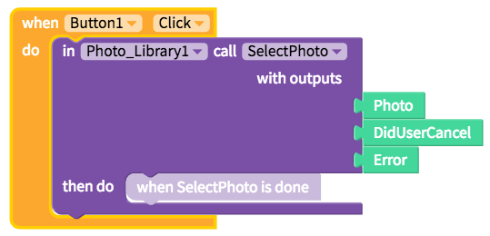

# Photo Library

* [Select Photo](photo-library.md#select-photo)

## Select Photo

| Property | Description |
| :--- | :--- |
| Select Photo \(`Photo`, `DidUserCancel`, `Error`\) | Opens the camera and saves the `Photo` after the user takes a picture. `DidUserCancel` is either 'true' or 'false' depending on whether or not the user cancelled selecting a photo. `Error` is the error message if there was an error in selecting the photo |

