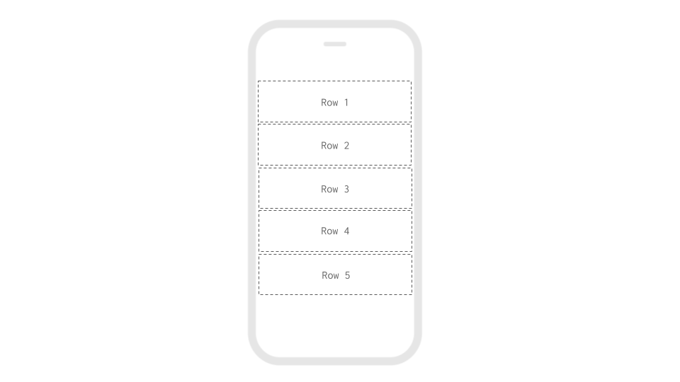

# Row

* [Set the size of the row](row.md#set-size-of-the-row)
* [Space the elements horizontally](row.md#space-the-elements-horizontally)
* [Space the elements vertically](row.md#space-the-elements-vertically)
* [Add a background color or picture](row.md#add-a-background-color-or-picture)

## Set size of the row

For more information on sizing in your app, please see our [introduction here​](../../intro-to-sizing.md)

| Property | Description |
| :--- | :--- |
| Height | Default \(`Fill container`\); `Fill container` sizes the row to fill the Screen or container that it is within. `Fit contents`  sizes the row to the size of its contents; `Relative size` size the row to a percent of the Screen or other container it is within; `Absolute size` sizes the row to a specific number of pixels |
| Width | Default \(`Fill container`\); `Fill container` sizes the row to fill the Screen or container that it is within. `Fit contents`  sizes the row to the size of its contents; `Relative size` size the row to a percent of the Screen or other container it is within; `Absolute size` sizes the row to a specific number of pixels |

## Space the elements horizontally

The `Justification` property allows you to space elements in a Row horizontally

## Space the elements vertically

The `Alignment` property allows you to space elements in a Row vertically

## Add a background color or picture

| Property | Description |
| :--- | :--- |
| Background Color | Default \(`none`\). Select any color using the color picker, RGBA or HEX value |
| Background Picture | You can upload a background image to your app or reference an image url e.g.`beaver-yellow.png` |
| Background Picture Resize Mode | Determines how to resize the image when the frame doesn't match the raw image dimensions;`cover`\(default\) Scale the image uniformly \(maintain the image's aspect ratio\) so that both dimensions \(width and height\) of the image will be equal to or larger than the corresponding dimension of the view \(minus padding\);`contain`Scale the image uniformly \(maintain the image's aspect ratio\) so that both dimensions \(width and height\) of the image will be equal to or less than the corresponding dimension of the view \(minus padding\);`stretch`Scale width and height independently, This may change the aspect ratio of the src;`repeat`Repeat the image to cover the frame of the view. The image will keep it's size and aspect ratio;`center`Centers the image in the frame |

