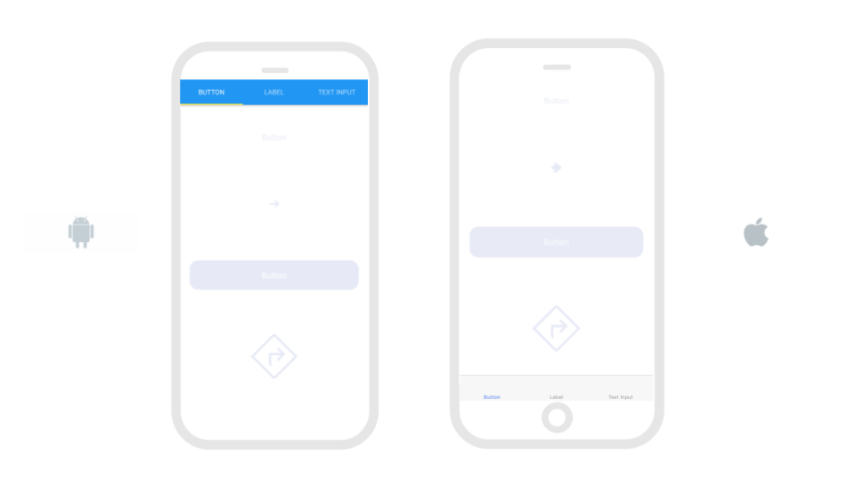

# Tab Navigator


The original Tab Navigator component has been retired for a separate [Top](top-tab-navigator.md) and [Bottom](bottom-tab-navigator.md) Tab Navigator. Existing projects that have the original Tab Navigator will continue to be supported but we encourage creators to migrate to the new [Top](top-tab-navigator.md) and [Bottom](bottom-tab-navigator.md) Tab Navigator. 


## Name your Tab\(s\)

To name your tabs, you'll have to navigate to the properties for your Screen

| Property | Description |
| :--- | :--- |
| Tab Bar Label | Title of your Tab |

## Set Tab bar to the top or bottom of the screen

| Property | Description |
| :--- | :--- |
| Tab Bar Position | Default \(`top`\); Other option is `bottom`; On Android, we recommend setting the tab bar on the `top`; for iOS, we recommend placing it on the `bottom` |

## Enable swiping

 Swiping is a popular way to move through screens and is enabled by the Tab Navigator

| Property | Description |
| :--- | :--- |
| Swipe Enabled | Default \(`false`\); If true, enables screen navigation by swiping |

## **Hide Tab bar**

To hide the Tab bar, you'll actually have to change a Screen property

| Property | Description |
| :--- | :--- |
| Tab Bar Visible | Default \(`true`\); If `false`, Tab bar will not be visible |

