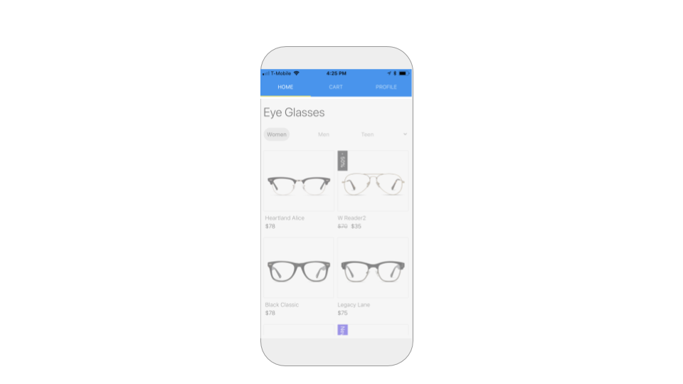

# Top Tab Navigator

## Style your Tab

You can set the background color, tab underline color for selected tabs and font color for selected and unselected tabs

| Property | Description |
| :--- | :--- |
| Background Color | Default \(`#007AFF`\); Background color for the top tab |
| Tab Indicator Color | Default \(`#FFEB3B`\); Tab underline color for selected tab |
| Active Tint Color | Default \(`#FFFFFF`\); Font color for selected tab |
| Inactive Tint Color | Default \(`#FFFFFF`\); Font color for unselected tab\(s\) |
| Upper Case Label \(advanced\) | Default \(`true`\); If `true`, tab labels will be converted to uppercase / capitalized letters |
| Tab Indicator Height \(advanced\) | Default \(`2`\); Height of the tab underline color |

## Add a Label and/or an Icon to your Tab\(s\)

You can choose to show just an icon, just a label or both a label and an icon or none at all.

| Property | Description |
| :--- | :--- |
| Show Label | Default \(`true`\); If `true`, labels will be displayed in the tab |
| Show Icon | Default \(`false`\); If `true`, icons will be displayed in the tab |

To add a label and/or icon, you'll have to navigate to the properties for your Screen

| Property | Description |
| :--- | :--- |
| Tab Bar Label | Name of your tab label |
| Active Tab Icon | Optional icon that appears when tab is selected; You can upload an image or type in an image url e.g.`home-red.png` |
| Inactive Tab Icon | Optional icon that appears when tab is not selected; You can upload an image or type in an image url e.g.`home-gray.png` |

## Enable swiping

Swiping is a popular way to move through screens and is enabled by the Tab Navigator

| Property | Description |
| :--- | :--- |
| Swipe Enabled | Default \(`false`\); If true, enables screen navigation by swiping |

