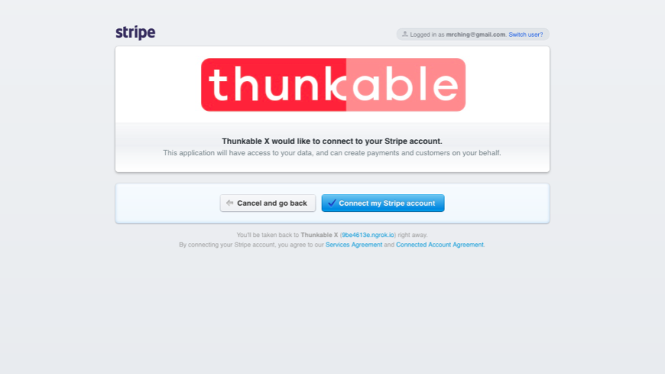
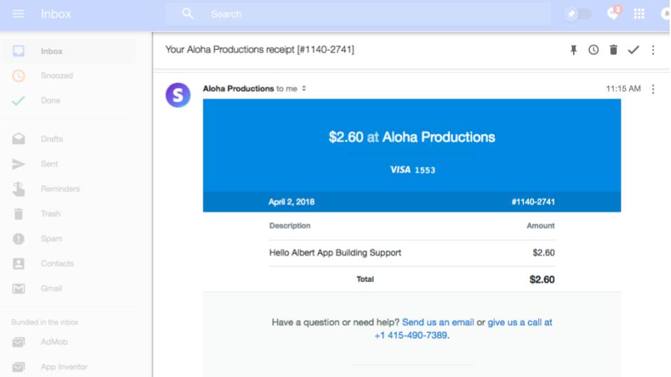

# Payment


The Payment component powered by Stripe charges a 4.9% fee +$0.30 per transaction, 2% of which is taken by Thunkable as a maintenance fee


* [Set up](payment.md#set-up)
* [Send a test transaction](payment.md#send-a-test-transaction)
* [Accept payments](payment.md#accept-payments)

On Android, the user does not have to submit any address information. On iOS, the developer can specify whether or not to require a full address or just a zipcode to submit a transaction. Requiring a full address may lower the risk of fraudulent activity.

## Set up

### Create your [Stripe](https://stripe.com/) account

### Apply to accept payments by credit or debit card

You'll have to apply to Stripe for your business to accept payment by credit or debit card

### Connect your Stripe account with Thunkable

There are three properties that you need to retrieve from Stripe to connect it with Thunkable: `Test Publishable Key` , `Live Publishable Key` and `Stripe Account ID`. The first two are retrievable from the Stripe dashboard while the third requires visiting a special link. In the interest of security, you'll have to navigate to the App Settings on Thunkable to enter the properties for Stripe

`Test Publishable Key`

On the Stripe dashboard, set your Developer toggle to "Viewing test data" and copy the Publishable key from the interface

`Live Publishable Key`

On the Stripe dashboard, set your Developer toggle to live and copy the Publishable key from the interface

`Stripe Account ID`

The Stripe Account ID is a unique account level ID that you retrieve by connecting your Stripe account to Thunkable. Make sure you are logged into your Stripe account and then visit **BOTH** [**x.thunkable.com/stripe/connect/test**](https://x.thunkable.com/stripe/connect/test) **and** [**x.thunkable.com/stripe/connect/live**](https://x.thunkable.com/stripe/connect/live) and click the buttons below

You should see the following on your Stripe dashboard if your connections were successful

## Send a test transaction

To send a test transaction, make sure your Stripe property setting is set to `Test Mode`

To submit a test transaction, we recommend using a test card with the number `4242 4242 4242 4242`. You can specify any expiration date, security code and billing address / zipcode \(if necessary\).

Apps that accept payments should have a simple form for collecting user information both for sending a receipt and collecting transaction information and a confirmation page for letting the user know if the transaction went through successfully

The Payment block itself returns a `chargeId` if the payment went through successfully or an `error` if it did not. The blocks below also include uploading data to a Spreadsheet if successful or an error message if the transaction did not go through.

| Event | Description |
| :--- | :--- |
| One Time Charge \(`amount`, `currency` in three letter abbreviation e.g. USD, `receiptEmail`, `receiptDescription`\) | Stripe accepts [135 different currencies](https://stripe.com/docs/currencies#charge-currencies) but `amount` is denoted in the currencies' smallest unit i.e. USD is measured in cents. If successful, returns a `chargeId` and `chargeInfo` . During live mode, a successful charge will send a receipt to the `receiptEmail` with the `receiptDescription` as the title. \(No email will be send during testing mode\). There are [minimum charge amounts](https://stripe.com/docs/currencies#charge-currencies) for certain currencies as per Stripe's rules |

If you toggle on "Viewing test data" and "Payments" on the Stripe Dashboard, you will be able to view your test transactions

## Accept payments

To accept payments, simply toggle the "Test Mode" to false in the Thunkable Stripe app settings

After you sent a successful transaction, you'll see both the user payment amount\(s\) on your Stripe dashboard as well as the Net amount \(the amount you receive = the user payment amount less $0.30 + 4.9% of the total amount, which includes both Stripe and Thunkable's fees\).

Users will also receive an email receipt if the email address is provided

