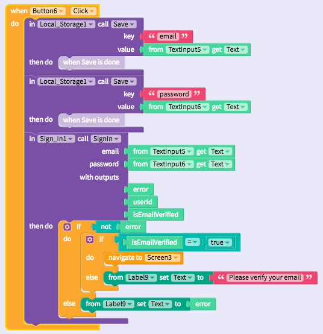

# Sign In

* [Set up](sign-in.md#set-up)
* [Basic sign in](sign-in.md#basic-sign-in-)
* [Manage user access](sign-in.md#managing-user-access)


To use Sign In, you will need to first create your own Firebase account and project


## Set up

### Create your free [Firebase](https://firebase.google.com/) account and create a new project

### Enable Email / Password sign in

In the Firebase console, navigate to Authentication and the tab "Sign-In Method". Enable Email/Password as shown below.

### Connect your Firebase account with Thunkable

There are two properties that you need to retrieve from Firebase to connect it with Thunkable which are both retrievable from the Firebase console: `API key` and `database URL`

`API key` and `database URL`

### \(Optional\) Modify the email template you send to verify your users' emails

## Sign up

The first step for users is to Sign Up with their email address and a password. They will be sent an email to verify the address that they provided. A sample block that also saves login credentials locally \(for a user's convenience\) is provided below:

| Event | Description |
| :--- | :--- |
| Sign up \( `email`, `password)`\) | Signs up a user for a new account. Returns an `error` if sign up is not successful. A common `error` is "The email address is already in use by another account." |

## Sign in

Users who sign up will be sent an email to verify the email address they provided is valid. You can use the blocks below to check whether they have verified their email before they can proceed further


There is currently a bug with email verification on Sign In


| Event | Description |
| :--- | :--- |
| Sign in \( `email`, `password`\) | Signs in an existing user. Returns an `error` if sign in is not successful, either because the email is not registered or the password is incorrect. You can also use the `isEmailVerified`output to limit user to sign in only if they have verified their email |
| Sign out \( `email`\) | Signs out a user from an account, usually to sign in with a different account |
| Reset password \( `email`\) | Sends an email to a user to reset his or her password |

## Manage user access

On the Firebase console, navigate to the Users tab under Authentication and you'll find a dashboard where you can reset a user's password, disable and delete their accounts.

