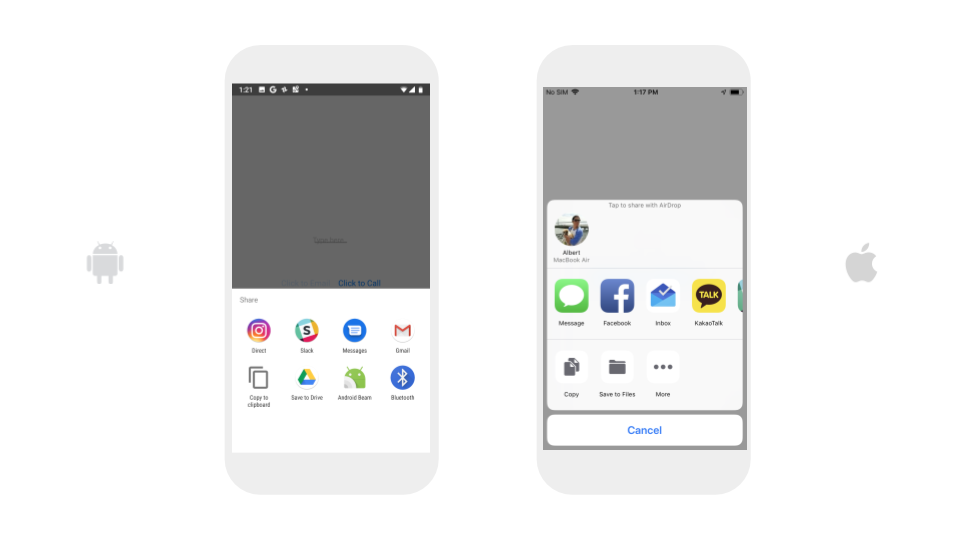

# Share

Sharing is caring and the Share component enables users to use the default apps on their mobile device to make a phone call, send a text, send an email or send a text or image via a user's pre-installed apps.

|  | Android | iOS |
| :--- | :--- | :--- |
| Make a phone call | Phone | Phone |
| Send a text | Messages  | iMessage |
| Send an email | Gmail | Mail |
| Share a text or image | Any pre-installed communication app \(e.g. WhatsApp, Slack, etc\) | Any pre-installed communication app \(e.g. WhatsApp, Slack, etc\) |

* [Make a phone call](share.md#make-a-phone-call)
* [Send a text](share.md#send-a-text)
* [Send an email](share.md#send-an-email)
* [Share a text or image](share.md#share-a-message)

## Make a phone call

| Event | Description |
| :--- | :--- |
| Call Phone \(`phone number`\) | Opens default Phone app to make a call to a specified `phone number` with one add'l click; does not make phone call automatically for security and safety reasons |

## Send a text

| Event | Description |
| :--- | :--- |
| Send Text Message \(`phone number`, `message`\) | Opens default messaging app to send a text `message` to a specified `phone number` with one add'l click; does not send text automatically for security and safety reasons |

## Send an email

| Event | Description |
| :--- | :--- |
| Send Email \(`to email`, `subject`,`message`\) | Opens default email app to send an email`message` to a specified `to email`  with one add'l click; does not send email automatically for security and safety reasons |

  

## Share a text or image

### Share a text

| Event | Description |
| :--- | :--- |
| Share Message \(`message`\) | Shares text via a user's choice of pre-installed communications app |

### Share an image

| Event | Description |
| :--- | :--- |
| Share Image \(`image`\) | Shares an image via a user's choice of pre-installed communications app |

