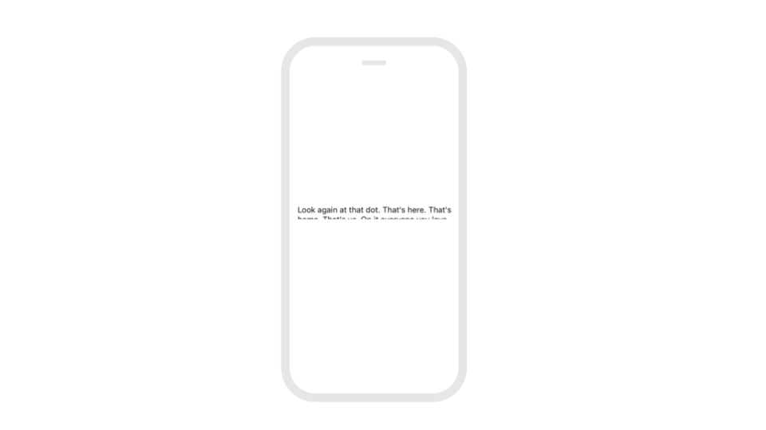

# Intro to Sizing

For the app developer today, deciding what mobile device to design for is challenging. On Android alone, there are thousands of different devices that are in popular use today. On iOS, there are still 8 different iPhone sizes and 4 different iPad sizes. 

By sizing your components optimally, you can support as many screen sizes and resolutions appropriately across platforms in a single project.

## Understanding the four sizing options

The following properties are available to all visible components in the `Height` and `Width` properties

| Property | Description |
| --- | --- | --- | --- | --- |
| `Relative size` | Sets the size as a percent of the Screen |
| `Absolute size` | Sets the size in pixels. The screen size of the Phone Previewer in the Designer is by default set to 500 px by 280 px but that may not reflect the size of your phone |
| `Fit contents` | Sizes an element to the contents  |
| `Fill container` | Sizes an element to fill the Screen, Row or Column that it is within |

## Use relative size for almost everything

Relative size is your best friend for almost all elements since it will auto-scale elements to the screen. In some cases, where there are fixed dimensions 

| Component | Recommendation |
| --- | --- | --- | --- | --- |
| Image or Button \(with Image\) | Use `Relative size` for height and width; Set Resize Mode property to `cover` or `contain`; You may also need to reference / upload images with a minimum resolution to not appear blurry on higher resolution screens |
| Labels and Text Input | Use `Relative size` for width; `Fit contents` for height |
| Row and Column | Usually `Fill container` for height and width; `Relative size`  otherwise |
| All Other Components | Use `Relative size` for height and width |

### The special case of images

Image with fixed dimensions and resolutions can be especially difficult to size. We recommend a simple approach that should work in most cases. 

1. Upload or reference images with a minimum resolution \(this varies by image size and device\)
2. Set the height and width in `relative size`
3. Set the resize mode property to either `cover` or `contain` \(see below\). This will autosize your image even if the dimensions of the image change

### Use Fit Contents for the height of Labels and Text Inputs

To ensure that the text is not cut off on the screen, in most cases we recommend using `Fit contents` to set the height of Labels and Text Inputs

## When to use absolute size

Despite the beauty of relative size, there are a few cases where setting elements in absolute size is recommended or required

### Use absolute size for Scrollable Screens

Since a Scrollable Screen has a height that is greater than the size of the Screen, the height of the elements must be set in `Absolute size`. 

> You can see an [example of a Scrollable Screen](../get-started/design-templates.md#scrollable-screen) in the Design Templates

