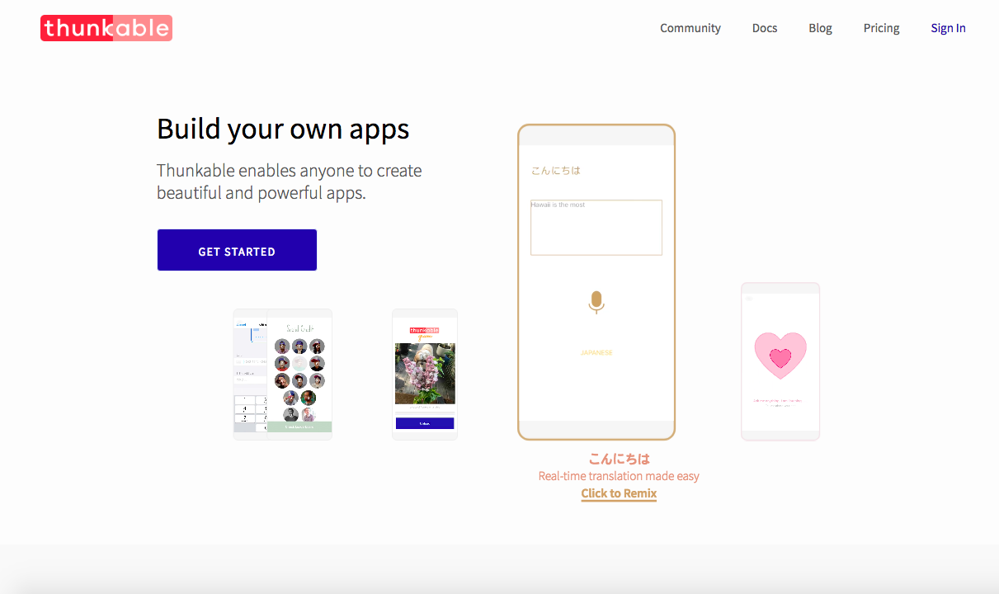

# Public vs Private Projects

## The Public / Private switch

One of the first decisions you have to make is whether or not your new project will be public.  Don't worry, you can always change it at any time in the App Settings.

## Public projects

### Public projects are eligible to be featured in the Thunkable Gallery on our homepage. Featured projects receive a lot of love \(and by love, we mean, remixes\).

### **Public projects can also be shared both in** [**fully-editable**](../share.md#share-a-fully-editable-copy-of-your-app-project) **and** [**read-only**](../share.md#share-a-read-only-version-of-your-app-project) **mode.**

## Private projects

### **Private projects will not appear in the Thunkable Gallery on the homepage.** 

### **Private projects can still be** [**shared as a fully-editable copy**](../share.md#share-a-fully-editable-copy-of-your-app-project) **by clicking on the Share button.**

###  

