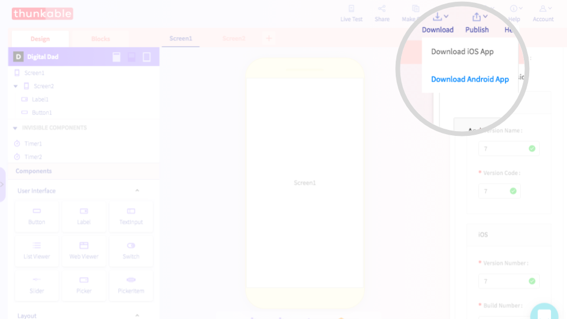
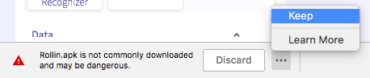
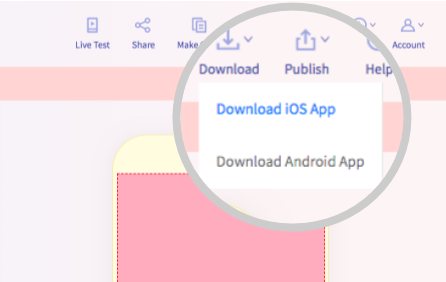
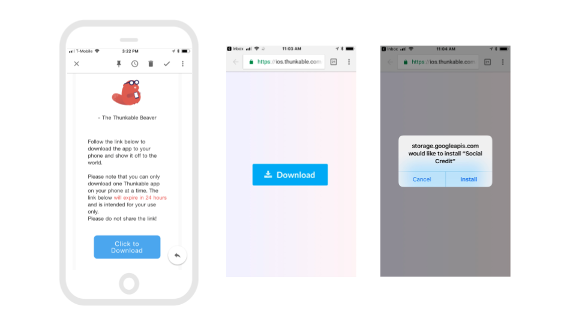
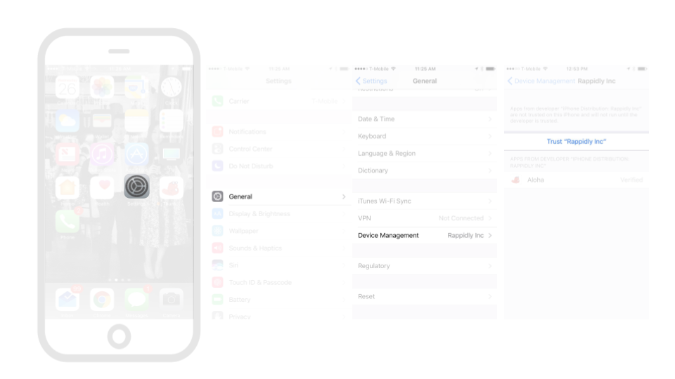

# Download


Before you download, we recommend first [adding an App Icon and Name](create/app-icon-+-name.md) to your app


* [Download limits](download.md#download-limits)
* [Download and install Android app](download.md#download-and-install-android-app)
* [Download and install iOS app](download.md#download-and-install-ios-app)

## Download limits

Due to special circumstances from Apple, there is a limit of one downloaded app per phone on iOS. Download wait times will also be a bit longer.

|  | Android | iOS |
| :--- | :--- | :--- |
| Download app limit | No limit | One app per phone |
| Download time | Up to a few minutes | Typically under 20 min |

## Download and install Android app

### Select Download Android app

To download your Android app, select Download Android App and an .apk file will be generated on your desktop

### Keep your .apk file

If you are using the latest version of Chrome you might see a notification that your app "_is not commonly downloaded and may be dangerous_". While some .apk files can potentially contain malicious software you are downloading an app that you have created yourself so there is no danger here. You can click on the "More Options" menu and choose the "Keep" option as highlighted below to complete your download.

### To install, allow apps from Unknown sources

Anyone installing your app directly, instead of from the Play Store, will need to change the setting on their phone to allow installation of apps from Unknown sources

## Download and install iOS app

### Select Download iOS app and enter your email address

You will receive an email when your app is ready to download. This usually takes 15-20 minutes but can take up to an hour

### Click on the download link in your email


The link to download the app is only intended for your own use and will expire after 24 hours


### To install, trust Thunkable on your device

On your first time downloading apps for iOS, you will need to open your `Settings` app, navigate to `General` and `Device Management` and then `Trust "Rappidly Inc"` \(the business name of Thunkable\)

### Troubleshooting

Common issues

**You receive an email from the hard-working beaver saying that this app will not build**

* You uploaded an icon that has the same name as an existing asset that you have uploaded
* Your app icon is not an image file
* We are having trouble with our build servers. Please try again in 30 minutes or chat with us if you are still having problems

**You cannot install your app and get the message "Cannot connect to storage.googleapis.com"**

* You have a special character like "&" in your [App Name](create/app-icon-+-name.md#app-name)

