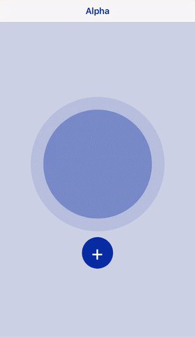
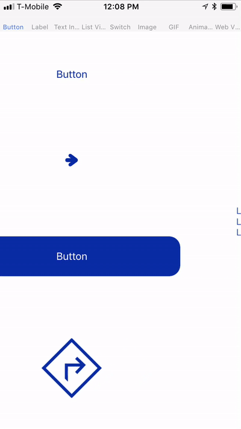
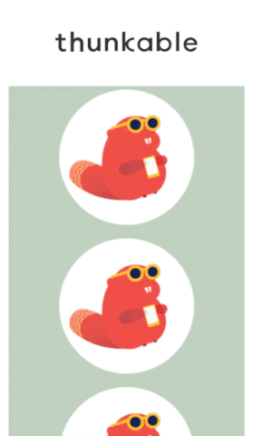
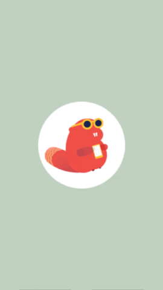

# Design Templates

## 

Almost any design that a modern app developer can make is possible ****on Thunkable ✕. Below are some of the most popular user interfaces that you may want to incorporate into your app.

## Popular

### Stackable

If you ever wondered how [Stack](../create/components/layout/stack-navigator.md) navigators work in an app, this template called Stackable should give you a good glimpse at what is currently possible. It displays the Header bar that is created as well as a top to bottom model transition that you can set. This template also displays some of our favorite Animations powered by [Lottie](../create/components/image/lottie.md) and the [Lottie community](https://www.lottiefiles.com/community). You can actually customize the colors of their animations with their built-in editor.

[**Click to copy**](https://goo.gl/nm7FGv)

### User Interface

There is a lot of design that you can do on the Thunkable platform and the User Interface template shows you some of the possibilities. All the visible components are displayed on a screen of their own in as many useful variations as we can think of

[**Click to copy**](https://goo.gl/VHK9sP)

### Scrollable Screen

A Scrollable screen can be made by setting Scrollable to `false` in a Screen to Column. Elements within the Screen or Column have to be sized with heights in absolute pixels which together exceed the height of the Screen or Column. For example, an iPhone 6 has a Screen height of 648 px so elements within it will have to collectively exceed that number for the elements to scroll. We also set the minWidth to `100%` of the Column in the advanced properties so that the scrolling Column does not move from left to right.

#### [Click to copy](https://goo.gl/C3hmvg)

### Swipeable Screens

Swipeable screens can be made by dropping Screens within a Tab navigator, setting SwipeEnabled to `false` in the Tab propeties and setting TabVisible to `false` in the Screen properties

#### [**Click to copy**](https://goo.gl/cdvEoG)

### Branding Screen

A Branding screen can be made setting a Timer to fire after `3000` milliseconds and navigate to the second screen

#### [**Click to copy**](https://goo.gl/p2k7uX)

