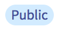
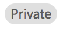
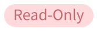

# Public & Private Projects

## Public projects

Public projects are included in the Thunkable Public Gallery for anyone to preview, download or remix. Any changes that you make to public projects are visible to those in the community in real-time. 

All users can create and edit public projects & public projects can be shared with anyone.

## Private projects

Private projects are just that, private. They are not included in the Thunkable Gallery and are for your eyes only. 

Only Thunkable PRO users have the ability to create and edit private projects. [Click here to learn more about PRO](https://thunkable.com/#/pricing).

Private projects can be shared but only with other Thunkers who have PRO membership.

Private projects become Read-Only projects when a Thunker's PRO membership expires.

## Read-Only projects 

Read-Only projects remain private and are not included in the Thunkable Gallery. You can preview them but not edit, download or publish them unless you switch them to Public. 

Once they have been switched to Public, they cannot be switched back to Read only.

Private projects become Read-Only projects when a Thunker's PRO membership expires but will switch back to Private if PRO is renewed.

## Legacy projects

Legacy projects can be edited in Private mode at any time and are denoted by  the cool beaver symbol above.

###  

