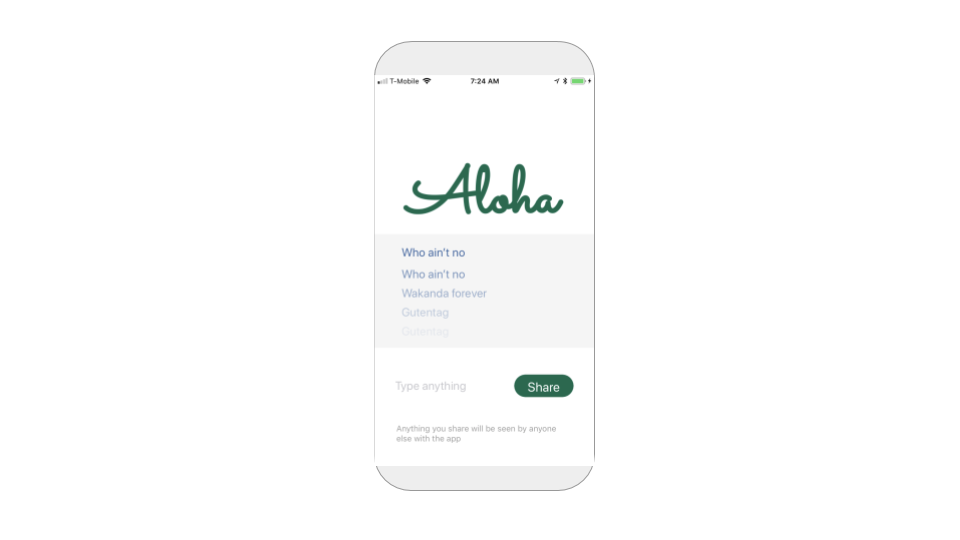
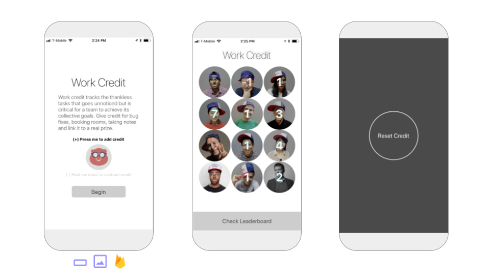
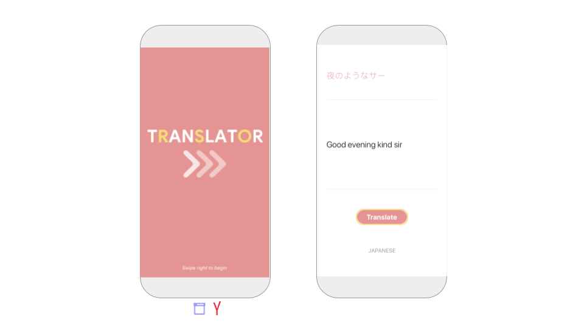

# Sample Apps

  
Thunkable is building the world's largest gallery of open sourced apps to help inspire you and save you time.

Below are a few of our favorites with more to come. Feel free to remix!

## Beginner 

### Beaver Bingo 

Beaver Bingo is a simple puzzle app that we think is great for parties. Party goers take photos of the items in the nine boxes, which together reveals a hidden message. The app features the [Image Recognizer](https://docs.thunkable.com/~/revisions/-LOOoZWLYzPlQ4m9-n_W/thunkable-cross-platform/create/components/image/image-recognizer) component from Microsoft. No goats were harmed in the making of this app.

​[**Click to remix**](https://goo.gl/avCsmh)

​

### Ukulele 

Ukulele is a simple soundboard app that plays the ukulele chords for one of our favorite songs of all time \(and of the [best Hawaiian songs of all time](http://www.honolulumagazine.com/Honolulu-Magazine/June-2007/50-Greatest-Songs-of-Hawai-8217i/index.php?cparticle=2&siarticle=1#artanc)\), _Waikiki_, recorded in 1946 by Andy Cummings. The ukulele chords themselves were recorded by an aspiring but very amateur ukulele player / thunker Albert Ching \(originally from Waikiki\)

​[**Click to remix**​](https://x.thunkable.com/copy/5fa58583cfa9f3f56b13fe30838b8a34?utm_source=Docs%20Ukulele)

Feel free to remix this for your favorite instruments although slower sounds will work better

### New Market Goods 

New Market Goods is a simple website app with a branding screen and a social media bar that opens a deep link to a user's installed apps that works across platforms. No set-up is required. If you'd like to learn how this app was made then check out our free tutorial in the [Thunkable Community](https://community.thunkable.com/t/business-app-new-market-goods/32448?u=domhnall)​

#### ​[Click to remix​](https://x.thunkable.com/copy/b6b5a10eff0464562aa7d50f99faeab8?utm_source=Docs%20New%20Market%20Goods) 

### Feelings 

Feelings is a swipe-able audio book powered by a Tab Navigator and a Text to Speech component. No set-up is required. You can find a step-by-step guide of how to build this app yourself in the [Thunkable Community](https://community.thunkable.com/t/audio-book-app-feelings/32601?u=domhnall).

#### ​[Click to remix](https://goo.gl/xs2ZYn)​ 

### Rollin 

If you've ever played a board game or an RPG then you know what dice are. You also probably know easy they are to lose or misplace. With this app you can create and customize as many dice and sound effects as you like so that they're never more than a click away. There's a free tutorial in the [Thunkable Community](https://community.thunkable.com/t/game-app-rollin/32715?u=domhnall) all about how this app was made.

\*\*\*\*[**Click to remix**](https://x.thunkable.com/copy/e36ce555a68f0b8af5420889df24b198?utm_source=Docs%20Rollin) ​

​

### Fun with Flags 

This simple trivia app will test your user's knowledge of country flags. By building something like this for yourself you will develop your understanding of parallel lists, functions, APIs, incrementers and, string matching. You can find a detailed tutorial of how to build this app in the [Thunkable Community](https://community.thunkable.com/t/quiz-app-fun-with-flags/32265?u=domhnall).

​[**Click to remix**​](https://x.thunkable.com/copy/0f20b428ce0fdca34f40d351fb34bcbc?utm_source=Docs%20Fun%20with%20Flags)

How well do you know your flags?

## **Medium** 

### Aloha 

Aloha is a private anonymous chat app with a short chat history powered by a [Firebase Realtime Database](https://docs.thunkable.com/~/revisions/-LOOoZWLYzPlQ4m9-n_W/thunkable-cross-platform/create/components/data/realtime-db). To [keep your data as private as possible](https://docs.thunkable.com/~/revisions/-LOOoZWLYzPlQ4m9-n_W/thunkable-cross-platform/create/app-data-privacy#create-your-own-private-repository-of-cloud-data), we recommend creating your own Firebase account and add your own API keys.

#### ​[Click to remix​](https://x.thunkable.com/copy/a65a5be1e59eea64b78e7eaabd3cf866?utm_source=Docs%20Aloha) 

Forget trusting big companies to comply with GDPR; this is a scary simple way to set up private chat where you own and control your chat history

### **こんにちは \(Kon'nichiwa\)** 

こんにちは is an app designed for travel in any country. It uses the newly upgraded [Speech Recognizer](https://docs.thunkable.com/~/revisions/-LOOoZWLYzPlQ4m9-n_W/thunkable-cross-platform/create/components/voice/speech-recognizer) combined with the [Translator](https://docs.thunkable.com/~/revisions/-LOOoZWLYzPlQ4m9-n_W/thunkable-cross-platform/create/components/voice/translator) component powered by Yandex to translate any spoke phrase into one of 87 supported languages. The app also features persistent data using [Local Storage](https://docs.thunkable.com/~/revisions/-LOOoZWLYzPlQ4m9-n_W/thunkable-cross-platform/create/components/data/local-storage), importing a list of data from [Spreadsheet](https://docs.thunkable.com/~/revisions/-LOOoZWLYzPlQ4m9-n_W/thunkable-cross-platform/create/components/data/spreadsheet), and sharing results with the [Share](https://docs.thunkable.com/~/revisions/-LOOoZWLYzPlQ4m9-n_W/thunkable-cross-platform/create/components/social/share) component.

​[**Click to remix**](https://goo.gl/DHp6Qv)​

### Personal Feed 

Personal Feed is an easy to edit feed of your favorite websites, powered by a simple Airtable [spreadsheet](https://docs.thunkable.com/~/revisions/-LOOoZWLYzPlQ4m9-n_W/thunkable-cross-platform/create/components/data/spreadsheet) with descriptions that you can modify at any time. This app can be remixed in a number of ways but this example shares popular men's blogger Mister Ching's favorite products for the summer. This app features a Stack Navigator, a Share component, and custom fonts in Labels as well!

#### ​[Click to remix](https://goo.gl/3Y9WuD)​ 

### Work Credit 

Work Credit is a team counting app for thankless tasks. The app shares data for the team in a private Firebase realtime database account so Thunkers looking to create one for their team will need to [set one up](https://docs.thunkable.com/x/components/data-storage/realtime-db.html#set-up). 

#### ​[Click to remix](https://x.thunkable.com/copy/19f21e06e130839ae24b7c9400041776?utm_source=Docs%20Work%20Credit)​ 

Work Credit has really transformed how our office works at Thunkable -- no longer are thankless tasks thankless. The winner each week gets to pick out our lunch destination on Friday \(which is quite an honor\)

### Translator 

Translator is an app that translates English text into the 20 most popular languages in the world; features advanced use of ListView and persistent data with Local Storage. No set-up is required although Thunkers can use their own Yandex API key if desired

#### ​[Click to remix​](https://x.thunkable.com/copy/7795ea69a4e5f889d51965d43abe0f13?utm_source=Docs%20Translator) 

### Dad 

Dad is a digital version of Albert's dad, based on a recorded interview and powered by Dialogflow's [Assistant](https://docs.thunkable.com/~/revisions/-LOOoZWLYzPlQ4m9-n_W/thunkable-cross-platform/create/components/voice/assistant) service. Thunkers must create their own Dialogflow account to customize their digital version. You can read more of the story of this app on [our blog](https://blog.thunkable.com/meet-my-dad-in-an-app-8a93ded720e0).

#### ​[Click to remix​](https://x.thunkable.com/copy/9ac106a73750f2eee39c6cde58fb0a6a?utm_source=Docs%20Dad) 

This is one of our favorite apps we've ever made on the platform -- it's a great combination of the latest in A.I. and voice technologies and our human need to keep our loved ones close to us at all times

### Weather 

Weather is an app that pulls the latest temperature from the [Open Weather Map API](https://www.openweathermap.org/api) and as a bonus the latest traffic from the Google Maps component; Thunkers are encouraged to create a free account to use their own Open Weather Map API key

​[**Click to remix**](https://x.thunkable.com/copy/e9009e9d022a9916ef12868b4b89e46f?utm_source=Docs%20Weather)\*\*\*\*

## Advanced 

### Ride 

Ride is a simple uber-like app designed for a single rider and driver that demonstrates some of the more complex possibilities of using the Google Maps APIs with the [Web API](https://docs.thunkable.com/~/revisions/-LOOoZWLYzPlQ4m9-n_W/thunkable-cross-platform/create/components/data/web-api) component including the geocoding, distance matrix and routing APIs. Developers will have to first create and use their own Google Maps API key and [Realtime DB](https://docs.thunkable.com/~/revisions/-LOOoZWLYzPlQ4m9-n_W/thunkable-cross-platform/create/components/data/realtime-db) with Firebase. This is the first sample app that uses the cool renaming component feature that was just implemented.

​[**Click to remix**](https://goo.gl/hzH5Hz)​

This sample app is inspired by the cycle rickshaws of Dhaka and estimates travel distance by rickshaw/bicycle

### Reservation 

Reservation is a demonstration of how to accept credit card payments through your app. Thunkers must create their own Stripe account \(please [follow the documentation](https://docs.thunkable.com/ios/components/monetisation/payments.html) carefully on set-up\). The app also uploads user data to a [spreadsheet](https://docs.thunkable.com/ios/components/data-storage/spreadsheets.html) for proper tracking of user transactions.

#### ​[**Click to remix**​](https://x.thunkable.com/copy/41eb1b5e0fa0cef568819d6cb86176db?utm_source=Docs%20Reservation) 

### Gram 

Gram is what photo sharing should be -- ad-free, auto-captioning and secure. This app features the Sign In component with Realtime DB both powered by Firebase, Image Recognizer by Microsoft and a way to "heart" photos. Thunkers must create their own Firebase account and add their own API keys and database url in their account settings.

#### ​[Click to remix​](https://x.thunkable.com/copy/14152657c536b372014169f83b34dd52?utm_source=Docs%20Gram) 

