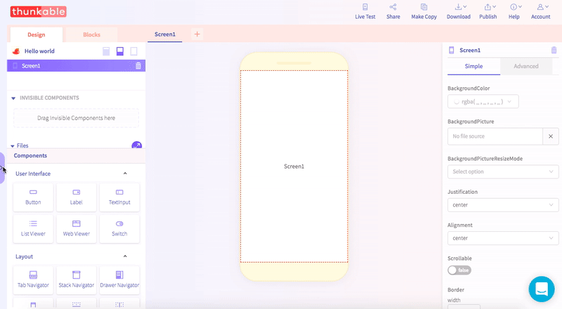

# Tutorials

## Overview

Thunkable ✕ includes step-by-step beginner tutorials built right in the platform. To view them, simply follow the two steps below.

We are also creating video tutorials that will walk you through some of the more advanced features of the platform. 

We also have a few intro guides in our docs that may help you with designing your app:

* [Intro to Spacing](../create/intro-to-spacing.md)
* [Intro to Sizing](../create/intro-to-sizing.md)
* [Design Tips](../create/design-tips.md)

## **Platform tutorials for beginners**

### **Create a new project**

### Click on the purple tab on the left to o**pen the tutorial panel**

