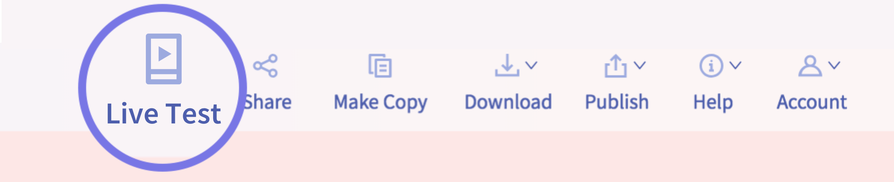

# Preview

Once you have synced your app with your project, every change you make to your project will be reflected in your app. Your app also lets you preview all your app projects from the comfort of your mobile device.

* [Download the Thunkable Live app\(s\)](live-test.md#download-the-thunkable-live-app-s)
* [Live Test](live-test.md#live-test)
* [Live Preview](live-test.md#live-preview)
* [Troubleshooting](live-test.md#troubleshooting)

## Download the Thunkable app\(s\)

The Thunkable app allows you to live test your app on your phone as you build it. Not even hard core developers have this super power. You can also preview all your app projects from the comfort of your mobile device.

| [**Download for Android**](https://play.google.com/store/apps/details?id=com.thunkable.live) | [**Download for iOS**](http://appstore.com/thunkablelive) |
| :--- | :--- |


If you don't have an iOS or Android device, you can also [set up an emulator](create/emulators.md) on your computer that will mimic what you would see on an actual device


## Live Test

After you have downloaded and logged into your Thunkable Live Android or iOS app on your phone, please select `Live Test` on the Thunkable web platform to sync your project with your app. Any changes that you make to your project should be reflected in your app. Some changes that you make may crash the app itself so it may be helpful to exit out of and re-open the app.

## Live Preview

For the first time, you can also now live preview all your app projects from the comfort of your mobile device. Simply login and you should see a list of all your projects on your Thunkable Live app.

## Troubleshooting

Common issues

### **You see a blank / white screen when you live test \(even if there are items in your app\)**

* If you have a Navigator as the first item in your tree, make sure your screen is dropped within it
* Your have unconnected blocks
* You have an event triggered by a Screen.Start which may be causing the screen to crash
* Your app and desktop may not be logged into the same account

**App is crashing because of a bug on our end; we are trying to fix it as soon as we can**

* \(Android only\) You are trying to set the value of a Slider in your blocks 
* \(Android only\) You are trying to set the latitude and longitude of a Map in your blocks

**Image is not showing up on your phone**

* The height or width of the image may be set to 'Fit contents'

