# Publish to App Store \(iOS\)


To publish your app to the App Store, we currently require users to turn off two-factor authentication. [Apple recently made a change](https://support.apple.com/en-ie/HT204915) requiring new users and those that have upgraded to the latest iOS or MacOS to turn on two-factor authentication. If you have two-factor authentication turned on, **you will currently\* not be able to publish to the iOS App Store.**

Please [**click here**](https://community.thunkable.com/t/important-two-factor-authentication-publishing-to-ios-app-store-on-thunkable-cross-platform/42504) to see our recommendations on how to turn off two-factor authentication.

\*We are working on a fix to enable publishing to iOS with two-factor authentication turned on which may take up to several weeks until available.


Publishing your app to the App Store can be a rewarding process. 

Apple requires a lot information for apps that are available in their App Store. As a result, the publishing process can feel long and will require at least 20 minutes to complete the necessary steps, which currently requires information from 4 different Apple websites.

Thunkable is continually looking for ways to streamline the publishing process and has made it possible for creators to publish from a non-Mac computer, which is normally required from the standard publishing process.

* [Minimum requirements](publish-to-app-store-ios.md#minimum-requirements)
* [Register your app](publish-to-app-store-ios.md#register-your-app)
* [Two-factor authentication](publish-to-app-store-ios.md#two-factor-authentication)
* [App Store Connect](publish-to-app-store-ios.md#app-store-connect)
* [App info](publish-to-app-store-ios.md#app-info)
* [Troubleshooting](publish-to-app-store-ios.md#troubleshooting)
* [Submit your app for review](publish-to-app-store-ios.md#submit-your-app-for-review)

## Minimum requirements


Apple holds a high standard for apps that are approved for distribution in the App Store so please [review Apple's policies and guidelines](https://developer.apple.com/app-store/review/guidelines/) to make sure your app is in compliance before you sign up for the Apple Developer Program


* Apple Developer Program membership \($100/year\). Don't have one? [**Sign up here**](https://developer.apple.com/programs/).

There are a few additional requirements for the App Store review that do take time to create:

* Design assets
  * Icon \(1024 x 1024 px\)
  * iPhone and iPad screenshots

## Register your app 

**Go to the** [**Apple Developer website**](https://developer.apple.com/account/ios/identifier/bundle/create) ****\(Certificates, Identifiers and Profiles\)

After login, the first thing you want to do is navigate to the App IDs section and register a new App ID.

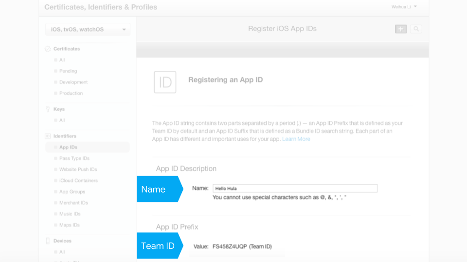

When you register an App ID, you'll have to pick an app `Name`.  The app Name must be unique to the App Store and is what appears next to the app icon when it is downloaded on a user's phone.

Apple will automatically create a `Team ID`. The `Team ID` is your unique account identifier that is linked to your Apple Developer Program membership.

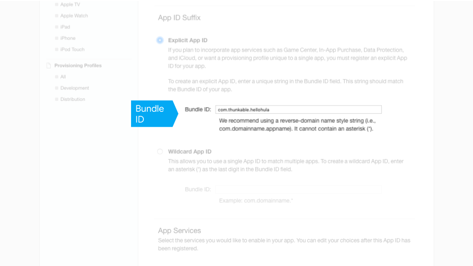

You will then create a `Bundle ID` which is unique to your app but not visible to your app users. If you plan on publishing multiple apps, we suggest you create a Wildcard App ID. Otherwise, a single Explicit App ID should work. 

Apple recommends reversing your domain name to create your bundle ID i.e. com.{yourdomain}.{appname} to avoid conflicts with other apps.

## Two-factor authentication

Two-factor authentication helps to keep your account secure and Apple is making it mandatory for new developers to turn two-factor authentication on. 

If you do have it turned on, you'll need to complete a few more steps to confirm your identity with Apple.

### Generate and upload an account certificate

First download the Certificate Signing Request \(CSR\) file.  You'l need this file to generate an account certificate.

**Go to the** [**Apple Developer website**](https://developer.apple.com/account/ios/identifier/bundle/create) ****\(Certificates, Identifiers and Profiles\)


You may already have an account certificate in your account. You can only have two certificates per account so you may need to revoke a certificate before you can create a new one.  


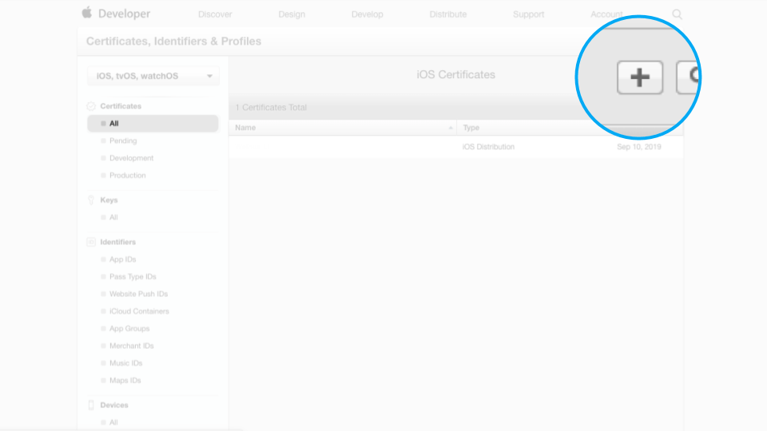

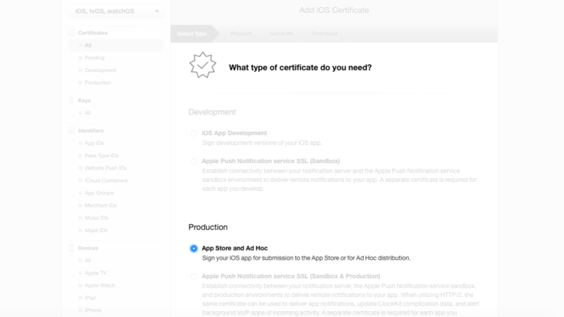

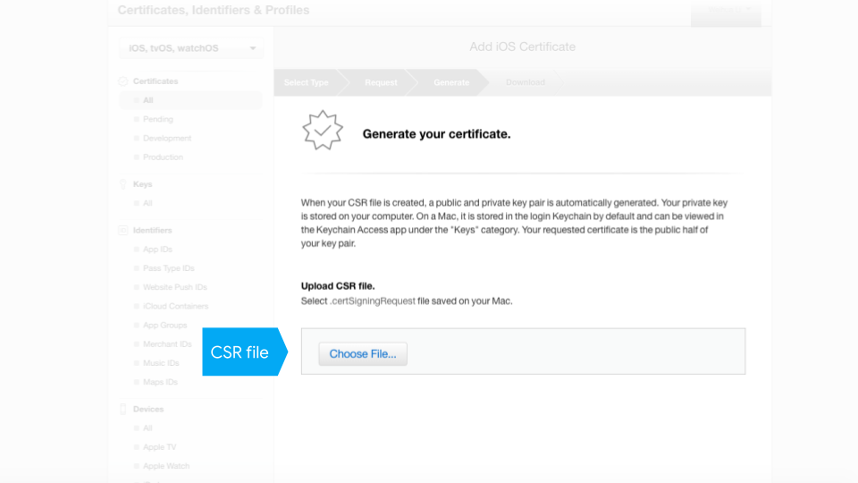

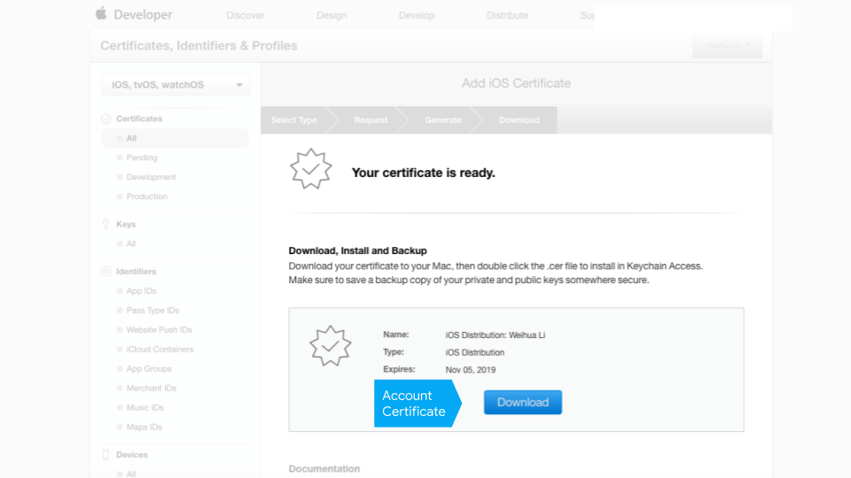

### Generate and upload an app provisioning profile

**Go to the** [**Apple Developer website**](https://developer.apple.com/account/ios/identifier/bundle/create) ****\(Certificates, Identifiers and Profiles\)

Provisioning profiles are required by Apple to install an app on a device.

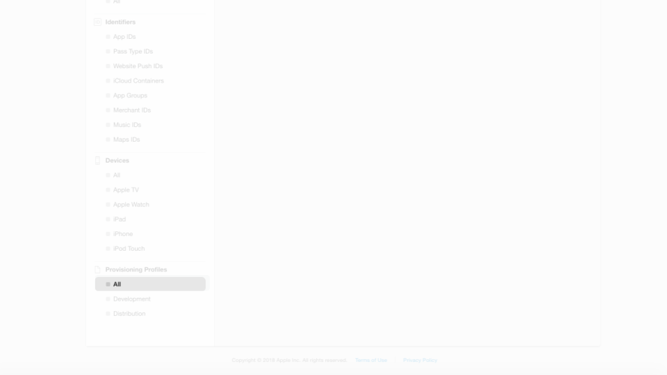

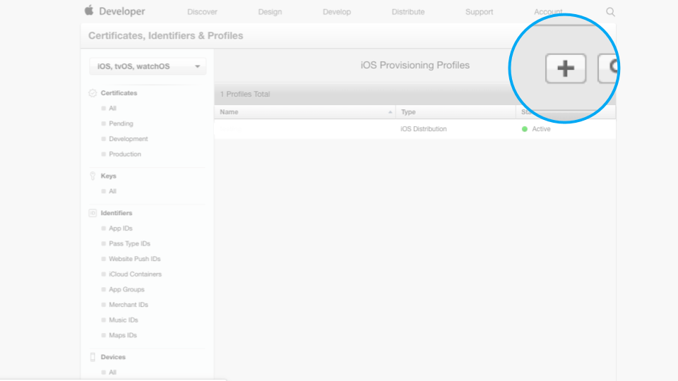

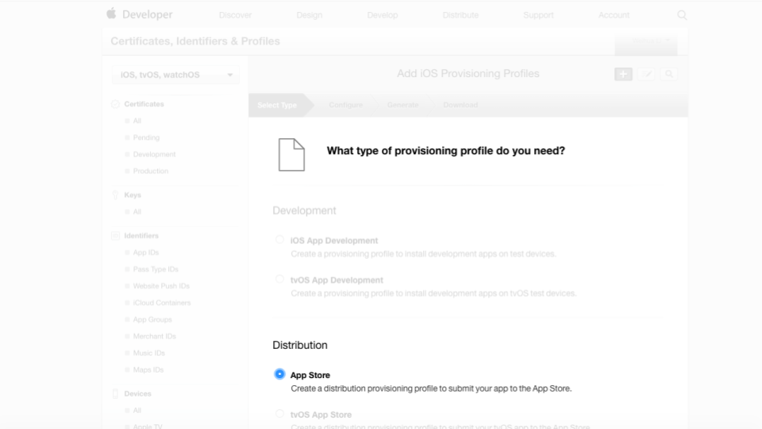

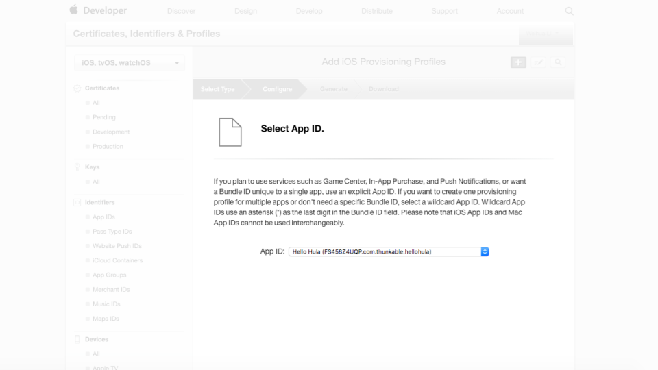

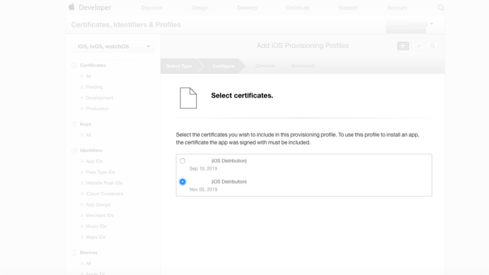

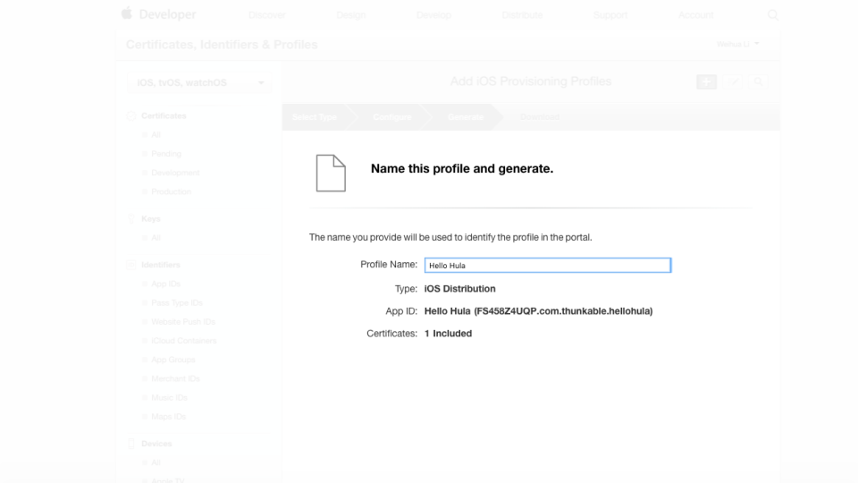

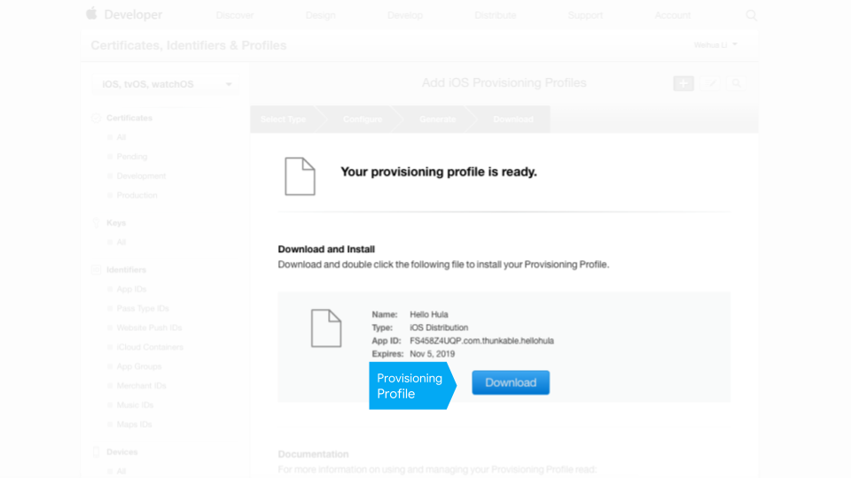

### Generate an app-specific password

#### Go to the [Apple ID account website](https://appleid.apple.com/#!&page=signin)

## App Store Connect

### Create a new app

#### Go to the [App Store Connect website](https://appstoreconnect.apple.com/login)

App Store Connect is your portal for managing your submission to the App Store.

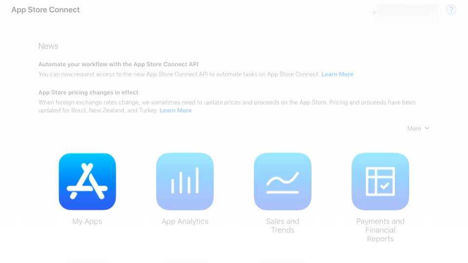

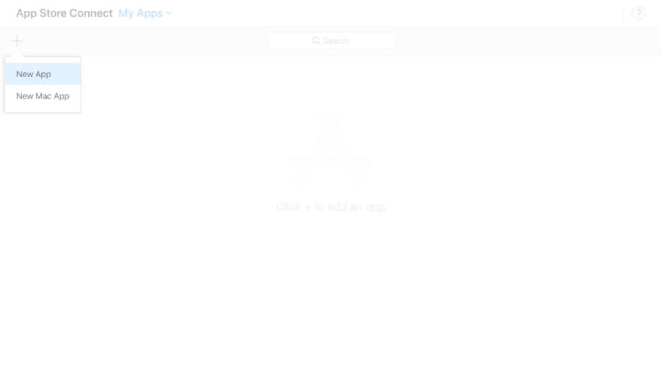

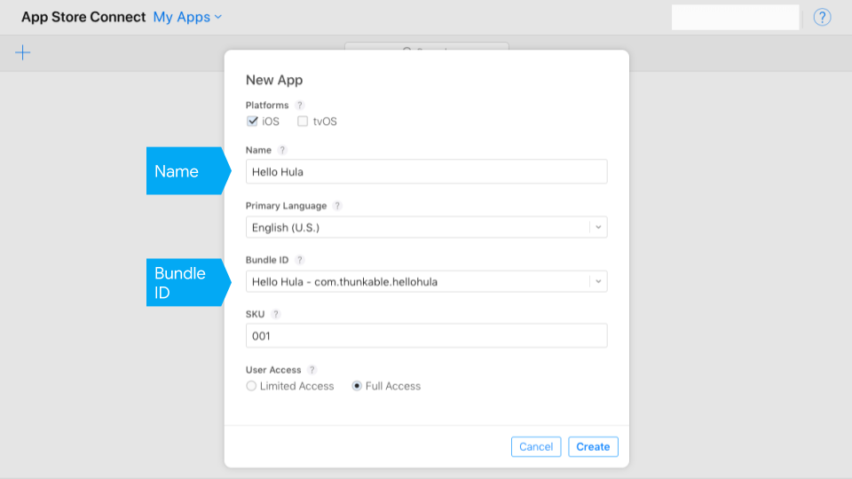

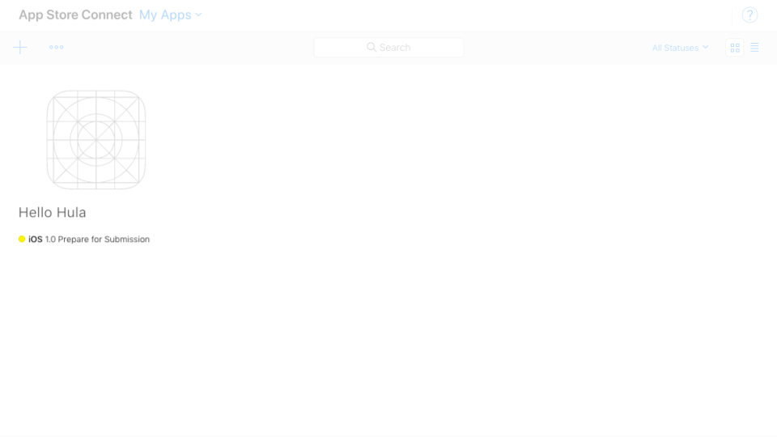

## App info

### Upload an app icon

We recommend an app icon that is 192 px by 192 px. This is

### Set a build and version number

### Permissions

Apple requires that you explain to users why you may need access to a sensitive component like 

## Troubleshooting

**You do not see your app uploaded to App Store Connect**

* Download. One way to check if your app is build-able is to download it to your phone first. Two common download errors are:
  * You uploaded an icon that has the same name as an existing asset that you have uploaded
  * Your app icon is not an image file
* Icons. Apple additionally does not allow you to have any icons with any transparent colors. We recommend app icons to be 192 x 192 px
* Membership. To publish to the App Store, you'll need to sign up for [Apple Developer Program Membership](https://developer.apple.com/programs/). This currently costs $99 / year.
* App Store Connect. Make sure to [follow this step](./#step-③--create-a-new-app-in-itunes-connect) on creating a new app on iTunes Connect
* Certificates. If you have an existing Apple Developer Program account with 2 iOS certificates, you'll have to revoke one. Apple only allows developers to have 2 iOS certificates at a time and Thunkable creates one when it publishes to your account
* Provisioning profile. After you revoke your certificate, it is possible that one or more of your provisioning profiles will become inactive.  To publish successfully, you'll also need to delete any inactive provisioning profiles
* Two-factor authentication. You must turn off two-factor authentication for your Apple Developer ID to publish with Thunkable. Please [click here](https://community.thunkable.com/t/important-two-factor-authentication-publishing-to-ios-app-store-on-thunkable-cross-platform/42504) to see our recommendations for turning off two-factor authentication 
* Login. Apple ID or password were entered incorrectly.  Since we don't store either one, there's no easy way for us to check so enter it slowly
* Apple ID an privacy terms. You must accept Apple's new Apple ID and privacy terms.

## Submit your app for review

**Congrats!** 

Your latest build will appear under the Testflight tab in your App Store Connect dashboard. Testflight is a tool from Apple that allows you to test your app before it is submitted for release in the App Store. You can use the tool to share your app with others.

You may need to answer a question about export compliance. You can select 'no' when asked if you app uses encryption since apps made on Thunkable for iOS do not at the moment.

Your app is now ready for internal testing to be downloaded by you and others and ready to submit to the App Store. We recommend you test your app via Testflight before you submit your app for review to the App Store.





After submitting your app for review, you may asked, **"Does this app use the Advertising Identifier \(IDFA\)?"** 


The app will still be able to be published but you will want to **check** the following three boxes:

* **Attribute this app installation to a previously served advertisement”**
* **“Attribute an action taken within this app to a previously served advertisement”**
* **“I, YOUR\_NAME, confirm that this app, and any third party…”**

Note, you should _not_ check the box labeled “Serve advertisements within the app”.


## 

There are 3 main sections to fill out.

The first section is **App Information** which is pretty straightforward.

The second section is **Pricing and Availability**. Also, very straightforward although there may be some strategy involved if you want to slowly release your app to different app stores \(New Zealand is a popular first country to launch in\).

The final section contains the design assets \(**Screenshots, App Icon**\) which you will need to have ready.


For the App Store, iOS requires you to submit an additional app icon with no transparency at sized at 1024 x 1024 px. To generate this icon, we recommend a tool [like this](https://makeappicon.com/) to generate this icon



By default, Thunkable submits your app to be available for both iPhone and iPad so you'll have to submit screenshots for both iPhone and iPad. **** For generating screenshots, we recommend a tool [like this](https://shotbot.io/?utm_source=makeappicon&utm_medium=web&utm_campaign=makeappicon)


You'll also need to select the build version that you want to submit.

#### Congrats! You are now ready to submit to the App Store.

