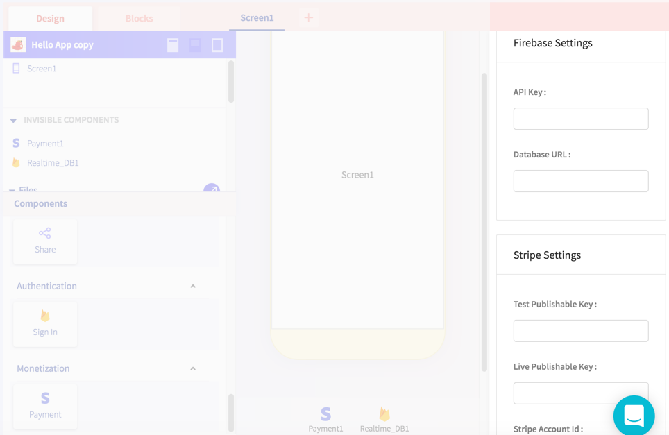
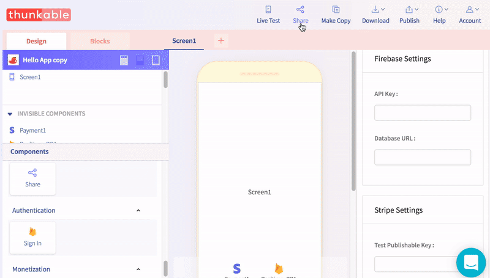
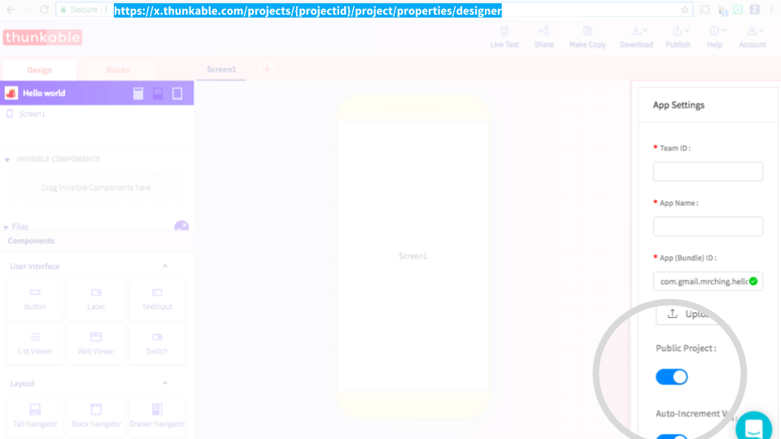

# Share

## Share a fully-editable copy of your app project

### Remove all API keys / passwords / other files you don't want to share

When you share your project, we automatically clear out any app settings which currently includes Firebase and Stripe keys and urls

### Generate a share link

When you generate a share link, it will create a copy of your app project at the point in time you generate the link. If you update your app and want your collaborators / remixers to have the latest copy, you'll have to generate a new link

### Share and track your links on your project page

When a user clicks on your share link, a copy of your app will automatically appear in their account. For every copy of your app that is created in a user's account, you will get credit for a share on your project page

## Share a read-only version of your app project

If you want to share a read-only version of your app project, you simply set your project to `Public` in your App Settings page and share the link of your project url

Users who visit the project url link do not automatically get a copy of your app in their account but they can use the [Make Copy](create/make-copy.md) button to create a copy if they wish

### 

