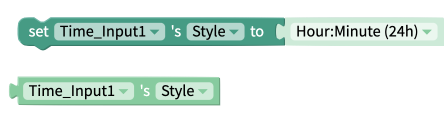
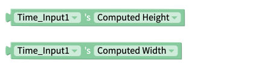

# Time Input

## Time Input Overview

A Time Input component is helpful when you want the user of your app to easily select a specific time using the native Android or iOS date picker

.png>)

## Properties

### Time Input

| Property    | Description                                 | Data Type                                               |
| ----------- | ------------------------------------------- | ------------------------------------------------------- |
| Style       | Format to use when displaying selected date | Select from menu `[Hour:Minute AM/PM, Hour:Minute 24h]` |
| Font Size   | Size of font when displaying date           | Number                                                  |
| Font Style  | Select whether font is italic               | True/False                                              |
| Font Weight | Select whether font is bold                 | True/False                                              |
| Color       | Color of font when displaying time          | Color                                                   |

### Layout

| Property    | Description                                                                          | Data Type                                    |
| ----------- | ------------------------------------------------------------------------------------ | -------------------------------------------- |
| X           | Location of top left corner of Time Input on X-axis, where the left hand side is X=0 | Number                                       |
| Y           | Location of top left corner of Time Input on Y-axis, where the top side is Y=0       | Number                                       |
| Height      | Height of Time Input in pixels                                                       | Number                                       |
| Width       | Width of Time Input in pixels                                                        | Number                                       |
| Resize Mode | Define dimensions of the time input component/container                              | Select from list `[Stretch, Float in Place]` |

### **Style**

| **Property**   | Description                                                                             | Data Type                                  |
| -------------- | --------------------------------------------------------------------------------------- | ------------------------------------------ |
| Visible        | Toggle whether your end users can see the Time Input                                    | True/False                                 |
| Border Style   | Set whether border style is solid, dotted or dashed  (only visible if border width > 0) | Select from list `[solid, dotted, dashed]` |
| Border Color   | Color of border (only visible if border width > 0)                                      | Color                                      |
| Border Width   | Width of border around Time Input in pixels                                             | Number                                     |
| Border Radius  | Radius of corners of border on Time Input in degrees                                    | Number                                     |
| Shadow Color   | Color of Time Input's shadow                                                            | Color                                      |
| Shadow Opacity | Opacity of Time Input's shadow                                                          | Number between 0 and 100                   |
| Shadow Radius  | Radius of corners of Time Input's shadow in pixels                                      | Number                                     |
| Shadow Offset  | How far Time Input's shadow should be offset, in Height and Width, in pixels            | Number                                     |

## Save the time

The time that a user selects will show up automatically in the Time Input label but if you want to save the date somewhere to be uploaded later, you'll need to add a block like the one below.&#x20;

| Event Property | Output                                |
| -------------- | ------------------------------------- |
| Get Time       | Date in whichever format you specify  |
| Get Hours      | Hour of the Day from `1-24`           |
| Get Minutes    | Minutes from `1-60`                   |

## Blocks

### Events

#### Time Picked

Fires when the user has selected a time with the Time Input

### Functions

#### Launch Picker

Launches the Time Input picker for the user to select a time.

#### Get Hour&#x20;

Returns the hour of the currently selected time in 24 hour format.

Example: if the user selects 2:30 PM, this block will return 14.

#### Get Minute&#x20;

Returns the minute of the currently selected time.

Example: if the user selects 2:30 PM, this block will return 30.

#### Get Time&#x20;

Returns the selected time in the same format as the Style [property](time-input.md#time-input) of the Time Input.

Example: if the user selects 2:30 PM, and the Style is set to Hour:Minute AM/PM, this block will return 2:30 PM.

If the user selects 2:30 PM, and the Style is set to Hour:Minute 24h, this block will return 14:30.

### Properties

Set and get [properties](time-input.md#properties) of the Time Input

#### Style

#### Computed Height and Width&#x20;

Returns the height/width of the Time Input on the device screen in pixels.

#### Visible

.png>)

#### Font Size&#x20;

.png>)

#### Color&#x20;

.png>)

#### Background Color&#x20;

Set the background color of the Time Input as it is displayed in the project.

.png>)

#### Font Style&#x20;

.png>)

#### Font Weight&#x20;

.png>)

#### Text Align&#x20;

Set the Text Alignment of the Time Input to `Auto`, `Left`, `Right`, `Center` or `Justify`.

.png>)

