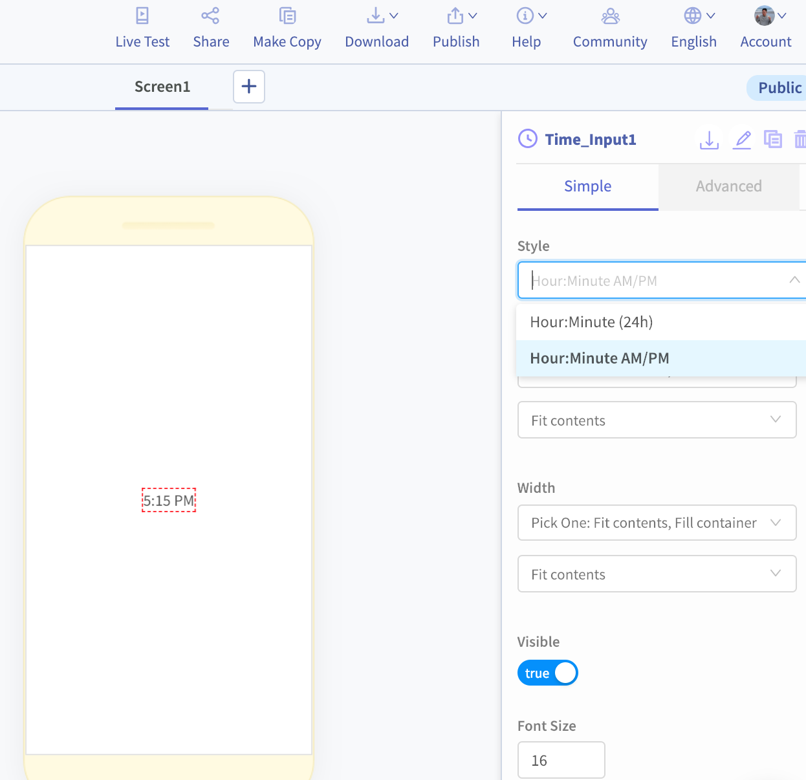
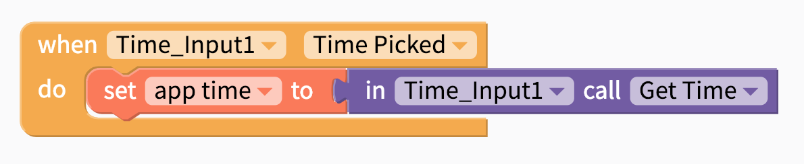

# Time Input

A Time Input component is helpful when you want the user of your app to easily select a specific time using the native Android or iOS date picker

## Getting Started 

The Time Input component needs no set-up \(Woohoo!\). Just drag and drop the component into your project. As a bonus, the current time will automatically show up as a label.

When a user of your app taps on the Date Input, it will automatically launch the native Android or iOS date pickers.

## Set the time format

You can set the format of the time by simply choosing your desired format from the `Style` property

## Save the time

The time that a user selects will show up automatically in the Time Input label but if you want to save the date somewhere to be uploaded later, you'll need to add a block like the one below. 

| Event Property | Output |
| :--- | :--- |
| Get Time | Date in whichever format you specify  |
| Get Hours | Hour of the Day from `1-24` |
| Get Minutes | Minutes from `1-60` |

