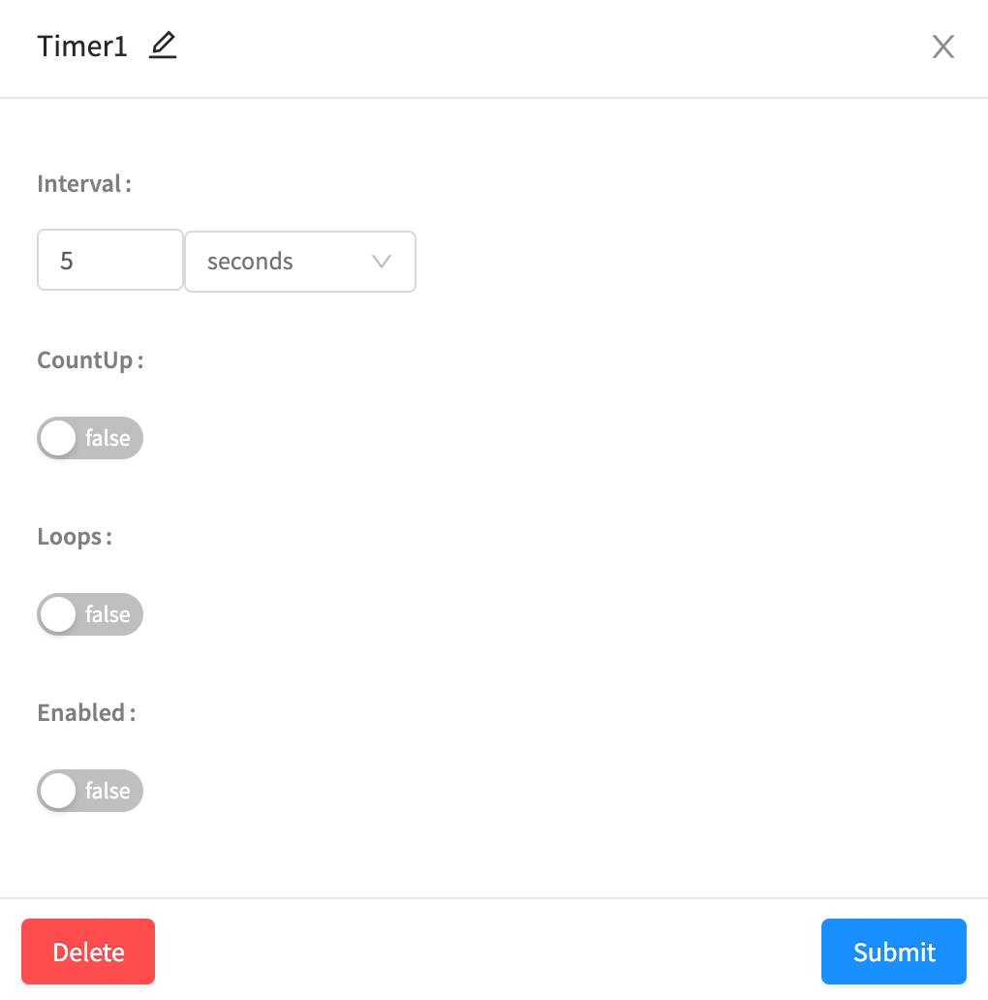
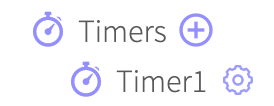
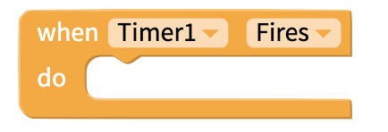
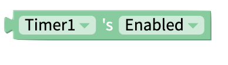

# Timer

## Adding Timers to your app

### Create a Timer

You can add a Timer to your app from the Blocks tab of your Thunkable project.\
Find the **Timers** drawer of blocks and click on the ⊕ icon to add a Timer to your app.

### Properties

| Property | Description                                                                                                                                                   | Data Type  |
| -------- | ------------------------------------------------------------------------------------------------------------------------------------------------------------- | ---------- |
| Interval | How regularly the Timer fires, in seconds or milliseconds                                                                                                     | Number     |
| Count Up | Toggle whether the timer [time blocks](timer.md#get-time-in-seconds) return the current time as counted up from 0, or counted down from the interval duration | True/False |
| Loop     | Toggle whether the Timer will start again once it has fired                                                                                                   | True/False |
| Enabled  | Toggle whether the Timer is active in your app                                                                                                                | True/False |

You can also **Delete** the Timer.

### Edit a Timer

You will see the Timers you have added to your app underneath the Timers section of your blocks.

## Blocks

### Events

#### When Timer Fires

Set something to happen when the Timer fires.

### Functions

#### Start Timer

Starts the Timer.

#### Stop Timer

Stops the Timer.

### Property Blocks

#### Get time in seconds

If `Count Up` is `false`, returns remaining time from the Timer's interval in seconds.

If `Count Up` is `true`, returns elapsed time from the Timer's interval in seconds.

#### Get time in milliseconds

If `Count Up` is `false`, returns remaining time from the Timer's interval in milliseconds.

If `Count Up` is `true`, returns elapsed time from the Timer's interval in milliseconds.

#### Set Interval

Set interval of Timer in milliseconds.

#### Get Interval of Timer

Returns interval of Timer in milliseconds

#### Set Count Up

Set whether Count Up **** is enabled for this Timer.

#### Get Count Up

Returns `true` or `false` value for whether Count Up is enabled for this Timer.

#### Set Loops

\
If `Loops = true`, the timer will reset itself after it fires. If your interval is 10 seconds, the Timer will fire every 10 seconds.‌

If `Loops = false`, the timer will finish its current interval if it is in the middle of one, and will no longer fire. If your interval is 10s, the timer will finish its current 10 second interval, fire, and then stop.

#### Get Loops

Returns `true` or `false` value for whether Loops is enabled for this Timer.

#### Set Enabled

Set whether the Timer is enabled.

#### Get Enabled

Returns `true` or `false` value for whether this Timer is enabled.
