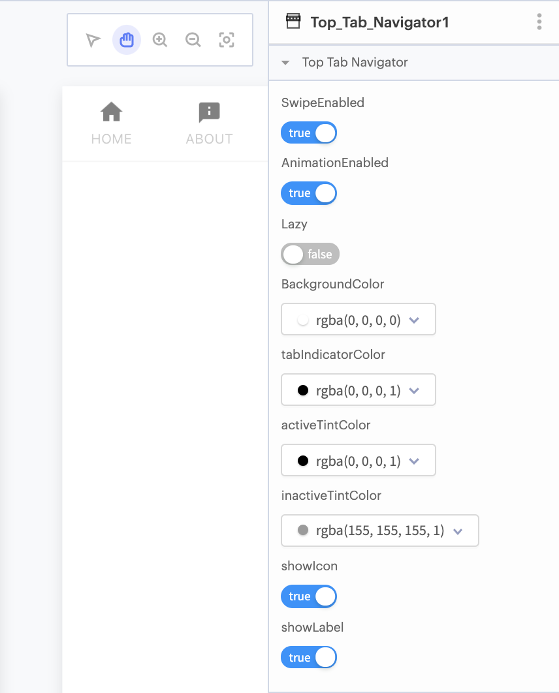

# Top Tab Navigator

The Top Tab Navigator is positioned at the top of your app, and allows users to switch between different screens by clicking.&#x20;

.png>)

## Video Tutorial

You can watch a video tutorial that explains all of the Navigators here:



## Adding Navigators

To add a navigator to your app, click **Screens +** at the top of your component tree. \
Select **Add Navigator** and select the Navigator you want to add.

## Tab Navigator Properties

You have many options for styling your Top Tab Navigator, such as changing the background color or tint color. Here are the different options for customization:

#### Simple Properties

* **SwipeEnabled:** Allow the user to swipe between screens.
* **AnimationEnabled:** Select whether to animate the transitions between screens.
* **Lazy:** If `true`, tabs are only loaded once the tab is opened. If `false`, all tabs are loaded when the Tab Navigator is first opened.
* **Background Color:** Select a color for the top tab navigator.&#x20;
* **Tab Indicator Color:** An underline will appear underneath the tab you select. You can select a color for the underline.&#x20;
* **Active Tint Color:** Select a font color for the tab currently in use.
* **Inactive Tint Color:** Select a color for the text of the tabs that are not in use.&#x20;
* **ShowIcon:** Toggle whether to show icons in the Tab Navigator.
* **ShowLabel:** Toggle whether to show tab labels in the Tab Navigator.

#### Advanced Properties

* **Upper Case Label:** Make the text for all the tabs upper case.&#x20;
* **PressColor:** Color of material ripple as a tab is pressed
* **PressOpacity:** Opacity of material ripple as a tab is pressed
* **ScrollEnabled:** Toggle whether to enable scrollable tabs
* **Tab Indicator Height:** An underline will appear underneath the tab you select. This section will allow you to choose how tall the underline is.

## Adding Labels and Icons to Your Tabs&#x20;

When designing a tab, you can use words or images to guide users to different screens.&#x20;

.png>)

.png>)

## Properties

**SwipeEnabled:** Let the user swipe between screens\
**AnimationEnabled:** show a smooth transition animation between screens\
**Lazy:** If true, only loads the screen the user has open at a time. If false, loads all screens when the Navigator is opened. \
**BackgroundColor:** Set background Color\
**tabIndicatorColor:** Set color of the line that displays beneath your active tab\
**activeTintColor:** Set color of the tab you are currently viewing\
**inactiveTintColor:** Set color of the tabs you are not currently viewing\
**showIcon:** Show tab Icons in Navigator\
**showLabel:** Show tab Labels in Navigator

## Screen-Specific Tab Navigator Properties

There are some Tab Navigator properties that are specific to each Screen in your Navigator, such as Tab Label and Tab Icon.

When you add a Screen to your Tab Navigator, you will a new section called **Tab Navigation Options** in your Screen's Properties panel with the following properties:

**Tab Bar Label:** Set the Label of this Screen's tab in the Tab Navigator\
**Active Tab Icon:** Set the Icon of this Screen's tab in the Tab Navigator for when the Screen is active\
**Inactive Tab Icon:** Set the Icon of this Screen's tab in the Tab Navigator for when the Screen is inactive\
**Tab Bar Visible:** Set whether the Tab Navigator is visible when this Screen is open
