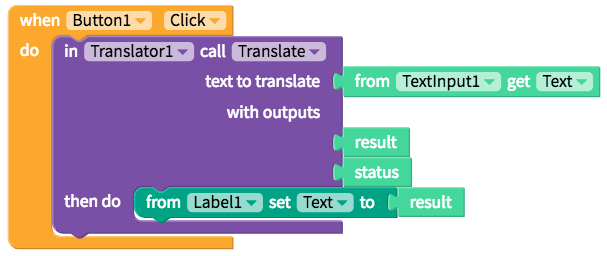

# Translator

* [Set up](translator.md#set-up)
* [Translate](translator.md#translate)

## Set up

There is no set-up required since Thunkable provides its own key to access the Yandex service. If you do not want to depend on Thunkable's default key, you can also use your own free API key from Yandex

| Property | Description |
| :--- | :--- |
| Yandex API Key | Thunkable is providing its own key by DEFAULT. You can sign up for your own key on Yandex |

### Select source and target languages

| Property | Description |
| :--- | :--- |
| Source Language | The name of the language to translate from. Currently available in 94 languages. |
| Target Language | The name of the language to translate to. Currently available in 94 languages |

## Translate

The blocks below translate a text from a Text Input and display the results as a label

