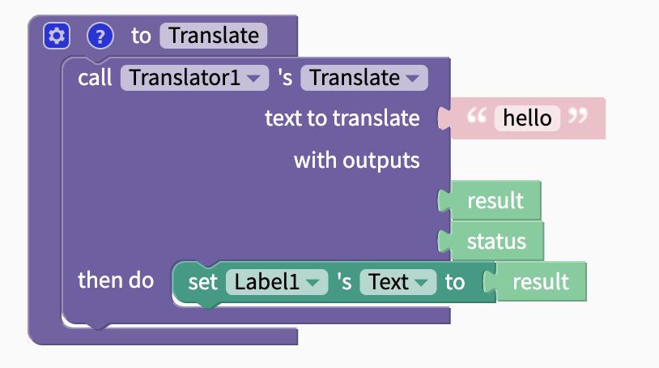
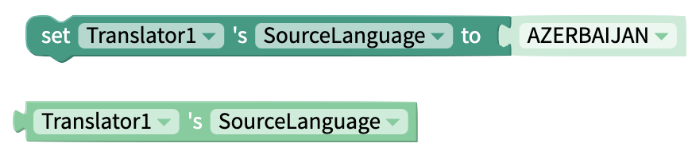
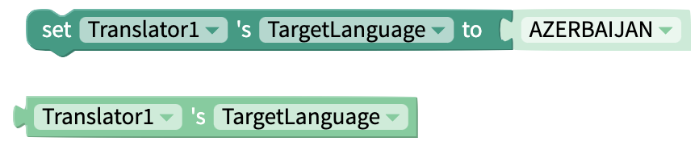
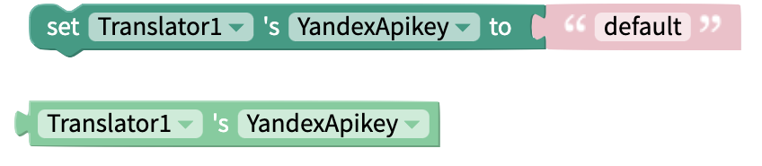

# Translator

## Properties

Source Language: Language of text that is to be translated. Can be changed in blocks.

Target Language: Language to translate text to. Can be changed in blocks.

Yandex API Key: If you have your own Yandex API key, enter it here. Uses Thunkable's `default` key by default.

## Blocks

### Functions

#### Translate

Translates a given piece of text from Source Language to Target Language. Returns result.

### Properties

#### Set/Get Source Language

Set source language using drop-down menu. Can also be set with [Text](text.md) blocks or [variables](variables.md). Any language code from [this list ](https://yandex.com/dev/translate/doc/dg/concepts/api-overview.html)can be used.

Get source language.

#### Set/Get Target Language

Set target language using drop-down menu. Can also be set with [Text](text.md) blocks or [variables](variables.md). Any language code from [this list ](https://yandex.com/dev/translate/doc/dg/concepts/api-overview.html)can be used.

Get target language.

#### Set/Get Yandex Key

Set Yandex API Key. 

Get Yandex API Key.

