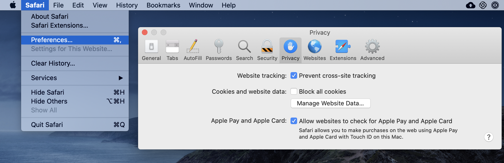

# Login Issues


We currently allow creators to log in with either a Gmail account or with any other email address the choose.


If you are seeing this page, you are likely having problems logging into our web platform. Our hardworking beaver is sad to hear that.

Fortunately, we have some recommendations that will hopefully help you fix your login issues. Our top suggestions are:

1. **Sign out completely** from Google and then sign back-in
2. **Switch your browser** to Chrome, Firefox or Safari \(if using Internet Explorer or Edge Web Browsers\)
3. [**Enable cookies**](login-issues.md#pro-tip-how-to-enable-cookies) in your browser, if you have them switched off.
4. **Uninstall AdBlocker** extensions or add-ons \(if you have them installed\)
5. **Disable Kaspersky Lab Antivirus** or whitelist thunkable.com \(if you have it installed\)

A helpful summary is below:

|  | **Compatible with Thunkable** | **Not compatible with Thunkable** |
| :--- | :--- | :--- |
| Browser | Chrome, Firefox or Safari | Microsoft Internet Explorer or Edge Web Browser |
| Cookies | Cookies enabled in the browser | Cookies disabled in the browser |
| AdBlockers | No AdBlockers extensions or add-ons | AdBlockers extensions or add-ons |
| Kaspersky Antivirus | Either disabling Kaspersky Lab Antivirus completely or whitelisting Thunkable.com | Kaspersky Lab Antivirus software |

## Pro-tip: How to enable cookies

To enable cookies, please follow the directions below:

## **Chrome**

In Chrome you need to make sure that you are allowing sites to save and read cookie data. You will also need to ensure that you **do not block** third-party cookies. 

Open you Chrome cookie settings: [chrome://settings/content/cookies](chrome://settings/content/cookies).

More info about cookies in Chrome [here](https://support.google.com/accounts/answer/61416?hl=en).

## **Firefox**

* You will need to have settings like the one below.  More info [here](https://support.mozilla.org/en-US/kb/enable-and-disable-cookies-website-preferences)**.**

## **Safari**

Open Safari &gt; Preferences ... &gt; Privacy

Prevent cross-site tracking should be **checked.** 

Block all cookies should be **unchecked**.

Read more about cross-site tracking [here](https://support.apple.com/en-ie/guide/safari/sfri40732/13.0/mac/10.15).

Read more about managing cookies [here](https://support.apple.com/en-ie/guide/safari/sfri11471/mac).

**IMPORTANT**: Please make sure to refresh your page after you enable cookies

