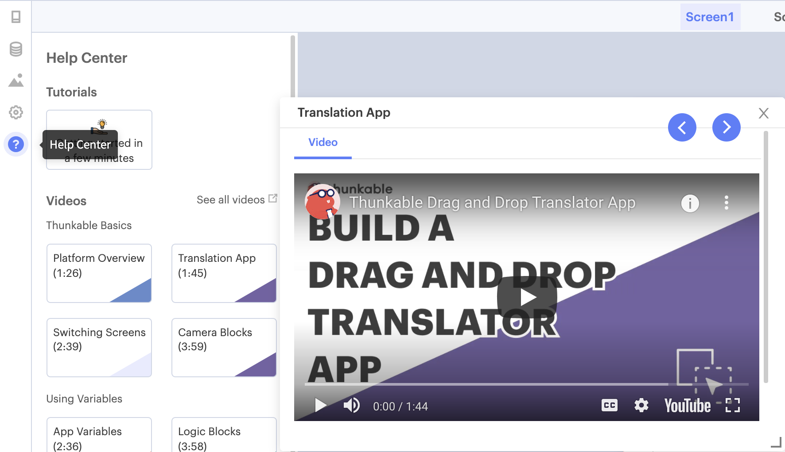

# Tutorials

## Build your first app in 2 minutes

Follow along to create a Translator app in minutes. Open the **Help Center** by clicking the Help button on the left side bar. Select the Translation App video tutorial, and follow it in your project designer.

## In-platform Tutorials

We offer many more tutorials and overviews within the **Help Center**. Clicking on an individual tutorial will launch a video modal that you can move and resize anywhere on the screen. 

## Video Tutorials - YouTube

Our [YouTube Channel](https://www.youtube.com/c/Thunkable) hosts the latest tutorials and step-by-step guides for bringing your projects to life. 

Follow step by step app building instructions in our [YouTube tutorial series](https://www.youtube.com/watch?v=dQQsvQr-f1U&list=PLB89L9PPGIrxGeViKhkRvHVD7yFc4q_Np)!

## Community Tutorials 


The Thunkable Community is where Thunkers share their ideas with the world. You can find a wide selection of staff and community written guides and tutorials in the [Thunkable Tutorials](https://community.thunkable.com/c/thunkable-tutorials/56) section.

