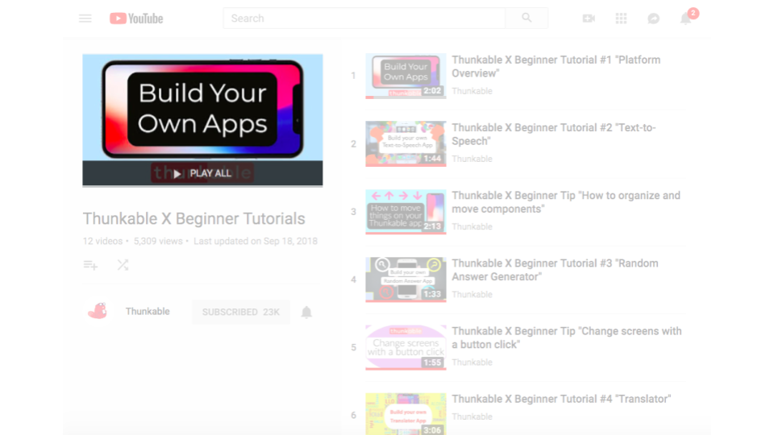

# Tutorials

## In-platform tutorials

To learn how to use Thunkable, try our in-platform tutorials. Click the pop out drawer on the left hand side of the screen to get started.

## [Video Tutorials](https://www.youtube.com/watch?v=YrONgW8udmM&list=PLB89L9PPGIrwpd62eYs6iOsHpjYboyuZE)

Follow step by step app building instructions in our YouTube tutorial series!

## [Community Tutorials](https://community.thunkable.com/c/thunkable-cross-tutorials)


The Thunkable Community is where Thunkers share their ideas with the world. You can find a wide selection of staff and community written guides and tutorials in the [Thunkable Cross Tutorials](https://community.thunkable.com/c/thunkable-cross-tutorials) section.

