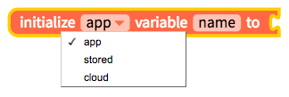
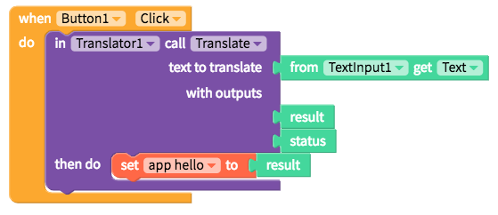
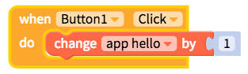

# Variables

## What is a Variable?

In app creation, variables work like containers to hold numbers, phrases, the results of a calculation, a database call, or other important values in the app, in the mobile device itself or in the cloud.

Instead of repeating these values in multiple places, a variable can be used wherever it is needed in your Blocks code.

## `App`, `stored` and `cloud` variables

When you create a variable, you'll have the choice between an app, stored and cloud variable. All variable types work across screens and the only difference is where they are stored.

An **app** variable works across screens and is stored in the app itself

A **stored** variable also works across screens but is saved to the mobile device itself. This means that a stored variable can be retrieved from a previous session. A stored variable is similar to saving a value to [Local Storage](local-storage.md) and is especially useful for retrieving a user's previous setting. If you use stored variables, you no longer need to add Local Storage to your app.

A **cloud** variable also works across screens but is saved to the cloud powered by Firebase. By default, the cloud variable is saved to the Thunkable default Firebase database but you can save them to your own private Firebase database by [following the instructions here](realtime-db.md#create-your-free-firebase-project-and-account). Cloud variables can be used similar to saving and retrieving values to a [Realtime DB](realtime-db.md) powered by Firebase and can be used in a number of applications that share data across users in the cloud. If you use cloud variables, you no longer need to add a Realtime DB to your app.

## Initialize a Variable When the App Starts

To create a variable when the app starts, you can grab the block above, select your variable `scope` \(app, stored, cloud\) and give the variable a `name` like hello. You'll have to connect a block to give app variables an initial value \(in the picture above\). We recommend placing these blocks in the initial app screen.

## Set a variable during an app event

You can also set a variable within a block event like the one above. Simply grab the set variable block and connect it to the value that you want it to be set to.

## Retrieving a variable

Once you have stored a value to your variable, you can retrieve it any time using a block like the one above.

## For `cloud` variables, updating when the cloud database changes

Cloud variables are unique because they can be linked to values in a cloud database which can be shared across devices. Once you have created your cloud variable, you can set it to update when the variable updates in the cloud. This block replaces the Add.Listener and DataChanged blocks in the Realtime DB. You can see how this works in the [Gram](https://x.thunkable.com/projectPage/5bbff7e035aa10fd7702f479) app, which updates the pictures, captions and hearts when anyone else with the app uploads a new photo.

## For `app` and `stored` variables, updating when the variable initializes or changes

This is similar to how cloud variables work above but it applies to variables that are changed in the app itself and not on a shared cloud database

## Changing a variable

Variables do not have to be fixed values and there may be times when you want to change your variable automatically like incrementing it by 1 after an event. To do so, grab a block like the one above.

