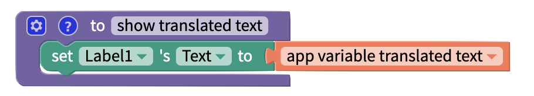

# Variables

## What is a Variable?

In app creation, variables work like containers to hold numbers, phrases, the results of a calculation, a database call, or other important values in the app, in the mobile device itself or in the cloud.

Instead of repeating these values in multiple places, a variable can be used wherever it is needed in your Blocks code.

## Video tutorials

You can find videos to demonstrate the use of [app variables](variables.md#app-variables), [stored variables](variables.md#stored-variables) and [cloud variables](variables.md#cloud-variables) below:

### App Variables



### Stored Variables



### Cloud Variables



## `App`, `stored` and `cloud` variables

When you create a variable, you'll have the choice between an app, stored and cloud variable. All variable types work across screens and the only difference is where they are stored.

### App Variables

An **app** variable works across screens and is stored in the app itself. \
You can save any data type as an app variable.

### Stored Variables

A **stored** variable also works across screens but is saved to the mobile device itself. This means that a stored variable can be retrieved from a previous session.

You can save any data type as a stored variable.

### Cloud Variables

A **cloud** variable also works across screens but is saved to the cloud powered by Firebase. \
\
By default, the cloud variable is saved to the Thunkable default Firebase database. We recommend saving them to your own private Firebase DB by [connecting a private Firebase DB to your app](variables.md#connecting-a-firebase-realtime-db-to-your-app).&#x20;

Cloud variables can be used similar to saving and retrieving values to a Realtime DB powered by Firebase and can be used in a number of applications that share data across users in the cloud. If you use cloud variables, you no longer need to add a Realtime DB to your app.

#### Cloud Variables and Data

You can only save a piece of [text](text.md) or an [object](objects.md) as a cloud variable.

To save a list as a cloud variable, use the 'make text from list' block to convert the list to a piece of text.

When you retrieve this text from your cloud variable, you can convert it to a list with the 'make list from text' block to work with it as a list in your app.

To save media as a cloud variable, use the [Cloudinary Media DB](camera.md#upload-image-to-the-cloud) component to upload your audio to the cloud and get a URL that points to it. You can save this URL as a cloud variable.

## Set Variable Value

### Initialize a Variable When the App Starts

To create a variable when the app starts, you can grab the block above, select your variable `scope` (app, stored, cloud) and give the variable a `name` like hello. You'll have to connect a block to give app variables an initial value (in the picture above). We recommend placing these blocks in the initial app screen.

### Set a variable during an app event

You can also set a variable within a block event like the one above. Simply grab the set variable block and connect it to the value that you want it to be set to.

### Changing a variable

Variables do not have to be fixed values and there may be times when you want to change your variable automatically like incrementing it by 1 after an event. To do so, grab a block like the one above.

## Get Variable Value

Once you have stored a value to your variable, you can retrieve it any time using a block like the one above.

## When variable initializes or changes

Once you have created your variable, you can set it to update when the variable updates in your app.&#x20;

With Cloud variables, this block will also be triggered when the value of the Cloud variable is changed in your Firebase DB. This block replaces the Add.Listener and DataChanged blocks in the Realtime DB.

## Dynamically named variables

The above blocks use hard coded variable names, where you must select a variable from a list of variables that you have initialized.

You can also create **dynamically named** variables. There are variables that you create and name during app runtime, which do not have an initialize block.

You can name these by typing in a name, or by using other variables to name the dynamically created variables.

You can create dynamically named app, stored or cloud variables.

## Connecting a Firebase Realtime DB to your App

### Create your free [Firebase](https://firebase.google.com) project and account

Thunkable provides a default Firebase account for testing purposes. When your app is ready to be distributed, we strongly advise connecting your app to your personal Firebase instance.

Firebase Realtime Database also pairs well with [Sign in](https://github.com/thunkable/thunkable-docs/tree/4a752596e288fca776105e94dc5e863bb9a3e25a/ios/components/screen-layout/authentication/sign-in.md) and you can use a single Firebase project for both services.

.png>)

### Edit Database Rules

If you are using [Sign In](sign-in.md) powered by Firebase in your app, you do not need to edit the default database rules which permit reading and writing to the database for authorized users.

Otherwise, you will need to set your Read and Write rules to `true`

### Connect Your Firebase Project with Thunkable

To connect your Firebase project with Thunkable, you'll have to add an `API key` and `Database URL` to the Firebase Settings in the App Settings, which you can find by clicking on the gear icon on the left hand side of the Design tab.

One way to retrieve the `API key` and `Database URL` from Firebase is to click on the `Add Firebase to your web app option`

.png>)

### Test Save to your Database

Once your project is connected to your Thunkable app, we recommend that you do a simple test and save a value into your database. It should appear in your data tab in your Firebase console.

